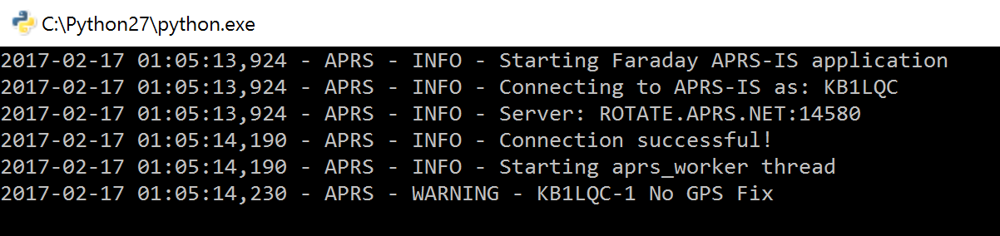

# APRS
The Automatic Packet Reporting System, [APRS](http://www.aprs.org/) has been around is some shape or form since 1982. It is a tried and true situation awareness application of ham radio. The [APRS-IS](http://www.aprs-is.net/) network is the common link between APRS gateways using the internet. Since Faraday modems connected to a computer use internet sockets to communicate with applications it is trivial to send data over the internet.

The APRS application is a core Faraday application provided by FaradayRF so that radio amateurs may leverage this heritage network with Faraday. Eventually we will provide an interconnected network for Faraday data. However, we're fans of what APRS has done to the hobby and are excited to be able to integrate with it.

## What Does the APRS Application Do?
This application provides a socket link to APRS-IS servers and sends data from Faraday to show up on the APRS-IS system. This way, you may use services such as the excellent [aprs.fi](https://www.aprs.fi) to view geospatial information. The current limitations include:

 * Data is only sent to APRS-IS and is not received from it
 * Only specific APRS Specification packet types relevant to Faraday have been implemented
 * Packets sent to APRS-IS are intended to not rebroadcast over RF (yet). However, this is not guaranteed and could end up on RF anyways.
 
# Configuration
Before you can connect to the APRS-IS network you need to create an `aprs.ini` file with your callsign.
 
 1. Navigate to the `Applications/APRS` folder
 2. Create a copy of `aprs.sample.ini` and rename the new file `aprs.ini`
 3. Open `aprs.ini` in a text editor and update the requested information noted by `REPLACEME`
 
Configuring APRS consists of changing one parameters for basic use:`CALLSIGN`.
 * `[APRSIS]`: APRS-IS credentials section
  * `CALLSIGN`: APRS-IS login callsign

## Obtaining an APRS Passcode
2E0SQL over at [MagicBug](http://magicbug.co.uk/) provides an beautifully simple open source [APRS Passcode Generator](http://apps.magicbug.co.uk/passcode/). The APRS application implements a python version of the passcode generator with the [generatePasscode()](https://github.com/FaradayRF/Faraday-Software/blob/issue91/Applications/APRS/aprs.py#L855) function. There is no need to enter your passcode, your amateur radio callsign will be used to automatically generate it.

# Running APRS
As a prerequisite, you must have the following programs running in the background while Faraday is connected to the computer:

 * Proxy
 * Telemetry
 
With these running simply run `aprs.py` and the application will startup. It continually loops through and queries Telemetry for new data from any recently heard station (default 5 minutes). The latest telemetry data from each active station is sent to APRS-IS once every minute by default.
 
## Correctly Running APRS Application

The application running above is nominal and connected to a `KB1LQC-1` Faraday radio through [Proxy](../../Proxy) which doesn't have a GPS. Since GPS Fix is therefore zero APRS simply warns that the unit has a bad GPS Fix. However, since we know it's configured with a fixed location in Flash memory this can be disregarded.
