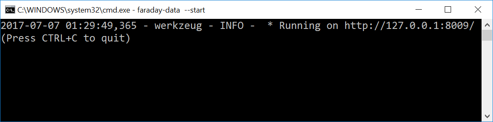
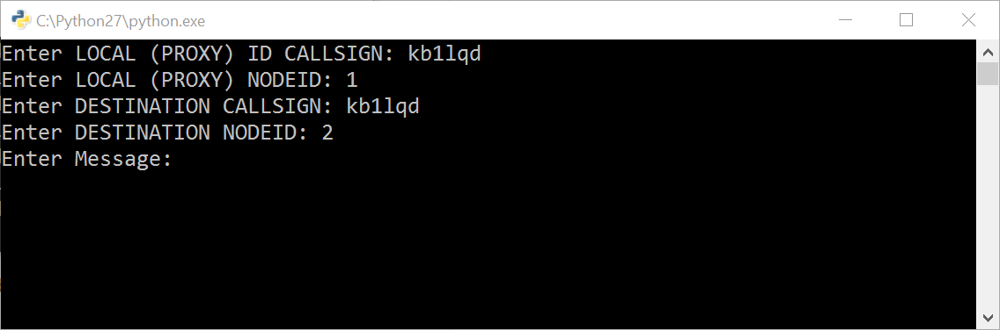
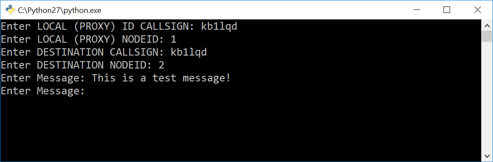
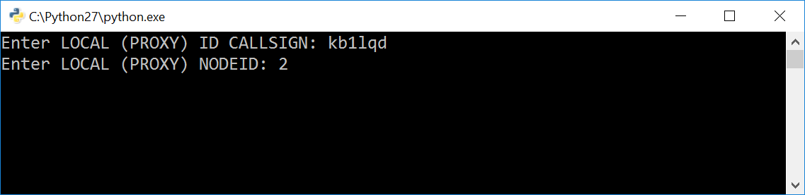
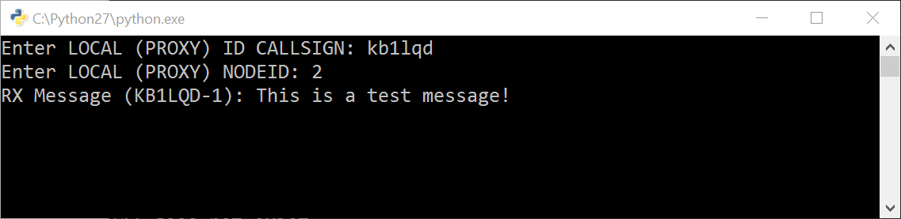

# Faraday Data Server Proxy Application Documentation

NOTE: This program is in active development. It is possible that bugs are present and features not yet added. Please report any bugs found or features that you feel should be included in the next release.

## Firmware

This application requires that all faraday units are programmed with [0e2e87ea838a1c8ee17174a4b56a0b9c34423424](https://github.com/FaradayRF/Faraday-Firmware/commit/0e2e87ea838a1c8ee17174a4b56a0b9c34423424) or the latest commit.

Use the [bootstrap loader software](https://github.com/FaradayRF/Faraday-Software/tree/master/Firmware_Bootstrap_Loader) to load the TI-HEX file located in `Debug/Faraday_D1_Release.txt`

[0e2e87ea838a1c8ee17174a4b56a0b9c34423424](https://github.com/FaradayRF/Faraday-Firmware/blob/0e2e87ea838a1c8ee17174a4b56a0b9c34423424/Debug/Faraday_D1_Release.txt) TI-HEX.

## Starting The Data Server

First, ensure that `faraday-data` is installed properly along with the faraday `pip` installation process.

Ensure that the configuration files are properly initialized using `faraday-data --init-config`. Use `faraday-data --help` for additional settings available.

To start the server once properly configured make sure the proxy is already running and use `faraday-data --start`.

## Sending And Receiving Data
While the data server is running data can be sent to or retrieved from the server by use of POST/GET requests.

All data sent to the server is expected to be BASE64 encoded, all data packet received from the server will be encoded in BASE64.

### Data Fragmentation

If a POST request is sent to the data server containing data larger than the maximum transmissible unit (MTU) it will be automatically fragmented. All packets transmitted through the data server will be a fixed size of the MTU and reassembly is not automatically performed on the receiving side (at this time). It is the job of the client applications to frame and reassemble original data frames. *This will be address in a later program update.*

## Server Packets

Detailed information can be found in the [packet definition Excel](Packets.xlsx).

### Transmits Packets
As noted in the packet excel document the transmitted packets contain:
* Packet Type
  * Indication of data or command packets for RFDataport operation
* Sequence
  * Counting sequence numbering of packets
* Data Payload
  * Remaining bytes are payload data. This is fixed length so data not long enough will be padded.

### Receive Packets

#### Data Packet

Data packets will be received from the FLASK server as the fragmented data packets only.

All packets transmitted through the data server will be a fixed size of the MTU and reassembly is not automatically performed on the receiving side (at this time). It is the job of the client applications to frame and reassemble original data frames. *This will be address in a later program update.*

# Client Applications
Several client applications are provided, mostly for initial bring-up and testing purposes at this time. The following program must be running prior to running the client applications:
* Proxy (`faraday-proxy`)
* Data server (`faraday-data`)

## msg_tx.py
This is a simple non-reliable (no error detection/retry) text message program transmitter for the Faraday data server. Run this program after starting the Data server and enter the requested callsign information.

* Local (Proxy) Callsign & Nodeid
  * This is the callsign and nodeid of the unit as connected to by the local proxy application. This is also the callsign that will be embedded into the text message frames for reassembly and TX station ID from the RX application.
* DESTINATION Callsign & ID
  * This is the callsign and nodeid of the Faraday unit (as programmed in firmware) intended to receive the message.
    * NOTE: At this time all transmissions are 'broadcast' and all units will receive and display the data.

Run the `msg_tx.py` script and *follow the prompts to enter faraday device connection information* for the transmitter and remote unit that is intended to receive the messages.

To transmit a message simply type the message and hit [Enter].

## msg_rx.py
This is a simple non-reliable text message program receiver for the faraday data server. Run this program after starting the Data server and enter the requested callsign information.

* Local (Proxy) Callsign & Nodeid
  * This is the callsign and nodeid of the unit as connected to by the local proxy application. This is also the callsign that will be embedded into the text message frames for reassembly and TX station ID from the RX application.

Run the `msg_rx.py` script and *follow the prompts to enter faraday device connection information* for the receiver.

While running the program will display all messages in real time as received. Note that due to the non-reliable nature of the application if a fragment is missing/corrupted then the transmitted data as received will either be corrupted, missing a portion of data, or not received all-together.

