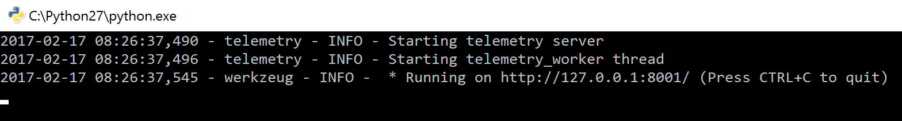
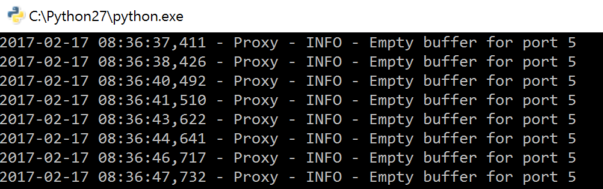
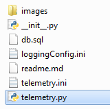
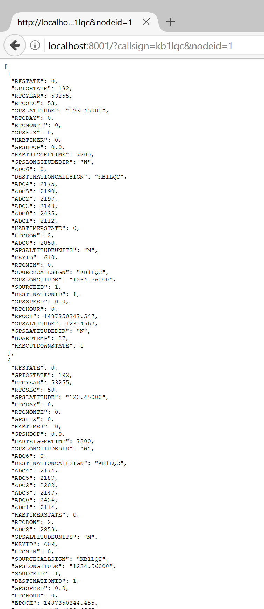
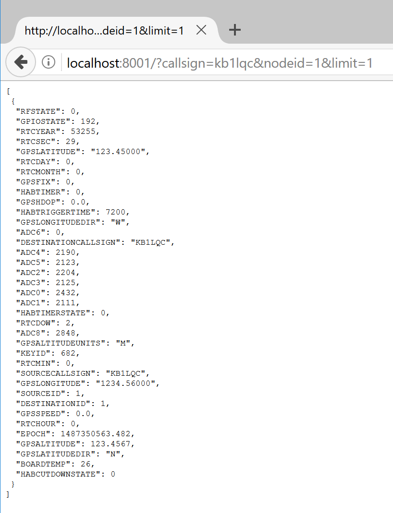

# Telemetry
The Telemetry application is a core application provided by FaradayRF. Its basic function is to receive telemetry packets from [Proxy](../../proxy) and save them into a SQLite database. Doing so allows us to document the data as well as search it easily in the future with SQL queries. Telemetry is built with a Flask server providing a simple API for searching the telemetry database file. The `telemetry_worker` function operates on its own thread to independently query Proxy for new data which continually updates the database in the background.

Basing Telemetry on a [Flask](http://flask.pocoo.org/) server allows it to provide a RESTful interface to the network interface from which other applications such as a user interface or [APRS](../aprs) can query the saved data using simple HTTP GET commands.

This also allows us to use a standard web browser for basic debugging. We can easily see telemetry data with a simple URL query as we will show you shortly. [DB Browser for SQLite](http://sqlitebrowser.org/) is also a great tool which allows you to manipulate the database and perform simple plotting. It's simple to use the program to export a CSV for plotting in Excel as well.

## Configuration

Telemetry uses [telemetry.ini](telemetry.ini) to properly connect to Proxy and save data to a SQLite database. This configuration file contains the following:

* `[FLASK]` Flask telemetry server section
 * `HOST` Flask hostname or IP address
 * `PORT` Network port to serve data

* `[DATABASE]` Telemetry SQlite database section
 * `FILENAME` Database filename "x.db"
 * `SCHEMANAME` SQLite schema file to setup tables "x.sql"

* `[TELEMETRY]` Telemetry application section
 * `UNITS` Quantity of Faraday radios connected to computer
 * `UNIT0CALL` Callsign of first radio
 * `UNIT0ID` Node ID of first radio

Configuring Telemetry consists of changing three parameters for basic use. The three configs to change are `UNITS`, `UNIT0CALL`, and `UNIT0ID`. These will let Telemetry properly query Proxy to obtain the correct telemetry data. Simply replace these values with appropriate data similar to how one configured [proxy.ini](../proxy/proxy.ini).

## Running Telemetry

> Telemetry expects [Proxy](../proxy) to be running on the same computer. Please ensure it is running in a window before attempting to start this application.

When this application starts-up it will create a database in the telemetry folder using the `FILENAME` if it doesn't already exist. If already present, the database will be opened and appended to. Once created, the program queries Proxy once per second for telemetry in its queues. Every Faraday physically connected to the computer will be queried. When data is retrieved from Proxy it is parsed and saved into a row of the `TELEMETRY` table. Any telemetry packet received by a Faraday radio over RF will also be saved.

Please note that Telemetry queries proxy once per second so you may see an INFO log on Proxy output indicating an `Empty buffer for port 5`. This is completly fine most of the time. The information simply means that there was no new telemetry (port 5) that Proxy could serve when requested by Telemetry.

### Windows

There are two ways to start Telemetry in Windows. First by command line and secondly by double-clicking on the file in explorer.

#### Command Line
1. Navigate to telemetry folder i.e. `cd C:\git\faradayrf\software\telemetry`
2. Open telemetry.py with python `python telemetry.py`

#### Explorer
1. Double-click on `telemetry.py`

2. Confirm python window opens and remains open

### Linux (Debian-based)
### OSX

## Exploring the database

The easiest way to explore the database with Faraday data in it is to use [DB Browser for SQLite](http://sqlitebrowser.org/). DB Browser works for Windows, Mac, and Linux.

The quickest way is to use your web browser!

### Web Browser

Using the RESTful Flask server enables development with web tools. We can query Telemetry for data from any web browser on your local computer. You also can use any of the development tools included with your browser to develop applications.

NOTE: Please see the Telemetry API section below for more details on what can be queried!
        
#### Example Web Queries

Telemetry expects several input URL parameters to perform a query on the SQLite database. If your query returns no results you will receive an HTTP 204 response which may result in your browser simply showing you the current page which could be stale data so please be aware. We also attempt to provide useful error feedback in JSON response.

##### Return Last Five Minutes
At a minimum to perform a Telemetry query you can simply return the last five minutes of telemetry data in the entire database

Query: `http://localhost:8001/`

This results in a JSON response which can be viewed in the browser.

##### Return Specific Station Data From Last Five Minutes
This response requires a specific `callsign` and `nodeid` to be search for as a URL parameter. This will respond with telemetry specific to ONLY the requested radio, local or remote, heard in the last five minutes.

Query: `http://localhost:8001/?callsign=kb1lqc&nodeid=1`

##### Return Limited Number of Telemetry Items
The `limit` URL parameter can be used with any of the URL search queries to limit the response to a specific number of telemetry items. If i wanted to limit the response from a query for KB1LQC-1 telemetry items to just one item I would perform the following query.

Query: `http://localhost:8001/?callsign=kb1lqc&nodeid=1&limit=1`

### SB Browser for SQLite
#### Windows

#### Linux (Debian-based)
The DB Browser website has clear and concise instructions to install the browser. However, one tip will be to install `apt-get-repository`. It is located in the `software-properties-common` package.

 * `sudo apt-get install software-properties-common`

#### Mac OSX

## Telemetry API

The following URL parameters are possible when interfacing the Telemetry server via a HTTP GET query, uppercase is not required for web URL input:

 * `CALLSIGN`: Station callsign
 * `NODEID`: Station node ID
 * `DIRECTION`: Boolean 0 or 1 indicating return of only local or RF station data respectively
 * `STARTTIME`: Start time (ISO 8601 "%Y-%m-%dT%H:%M:%S") of data to be obtained from SQLite database
 * `ENDTIME`: End time (ISO 8601 "%Y-%m-%dT%H:%M:%S") of data to be obtained from SQLite database
 * `TIMESPAN`: Timespan ending with current time of data to be obtained from SQLite database
 * `LIMIT`: Number of telemetry items to be returned in the query. Number of JSON items.
        
The API will be better documented shortly. Barebones at the moment!