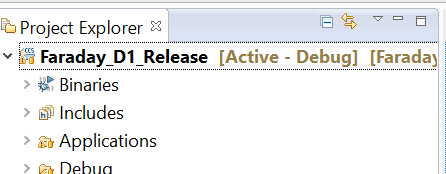
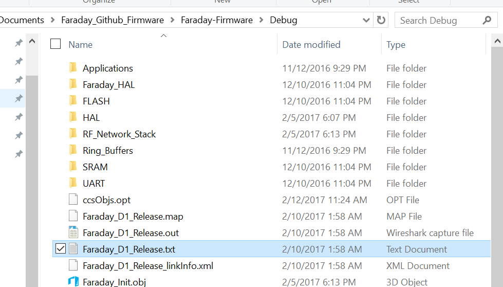
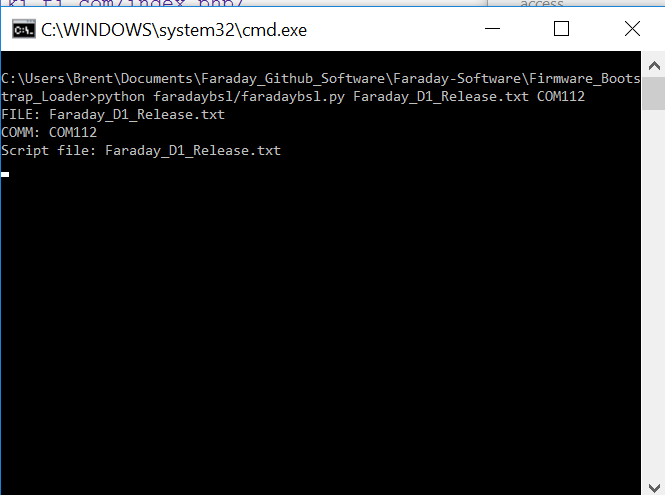
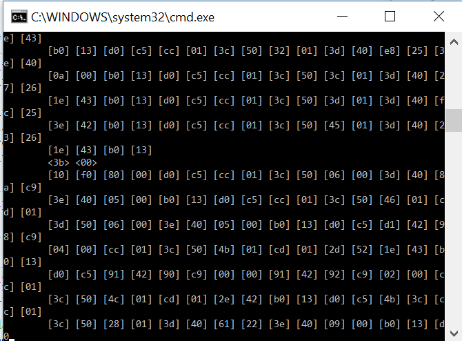

# Progaming Faraday - Bootstrap Loader (Windows)

Faraday can be re-programmed using 2 methods:

* JTAG connection
  * Programming + debugging
* Bootstrap Loader (USB)
  * Programming only

This tutorial will focus on programming your Faraday using only the USB connection to a computer. Using the Bootstrap Loader (BSL) is a convienient way to upgrade firmware and perform basic firmware development when debugging features are not required.

> Note: Ensure Proxy is NOT running when trying to program using BSL

This tutorial and version of Faraday BSL has only been tested on Windows. Future efforts will bring this capability to other operating systems.

###Prerequisits
 * Faraday radio connected via USB to the computer
 * Proxy configured and running
 * Firmware HEX file in TI-TXT format

## Getting Firmware HEX Files

BSL requires the use of a HEX file containing the intended firmware that will be programmed to the device in TI-TXT format. This tutorial assumes two methods:

* Obtained a firmware file from a pre-made source such as Faraday's GitHub repository
* Creating a firmware HEX file from Code Composer Studio

### Code Composer TI-TXT Hex Generation

> Note: Make sure to [setup TI-TXT HEX](http://processors.wiki.ti.com/index.php/Generating_and_Loading_MSP430_Binary_Files#Using_CCS_v6.x) file generation in CCS 

Generate the HEX file by compiling the firmware, after successful compilation the `.txt` file will be in the ../Debug path of the CCS project. The file will be named after the project name automatically.

Compiling the program will create the file as highlighted below.

`Faraday_D1_Release.txt` is the HEX file in TI-TXT format ready to be programmed into Faraday using the BSL.

# Using The BSL

Copy and paste the intended firmware HEX file into the main Faraday BSL directory: 

https://github.com/FaradayRF/Faraday-Software/tree/master/Firmware_Bootstrap_Loader

Edit the `faradaybsl.bat` script to point to the correct firmware HEX file name and COM port as needed.

`python faradaybsl/faradaybsl.py Faraday_D1_Release.txt COM112`

Finally, execute the Batch script.

### Proper BSL Execution

Running the Batch script will open a command prompt window that automatically performs device programming. 

**BSL programming will begin by forcing Faraday into BSL mode which takes several seconds.** 

**This is followed by programming which looks like fast moving HEX scrolling down the window.** 

**Completion is verified with a CRC check indicating program success verification completed.**

Faraday will now wait abbout 6-10 seconds to reboot and the command prompt will close. Observe Faraday reboot with the newly programmed firmware!

> Note: If programming is showing sticato HEX and the progrm takes longer than 30 seconds to program there is a setup problem and BSl programming will fail.
