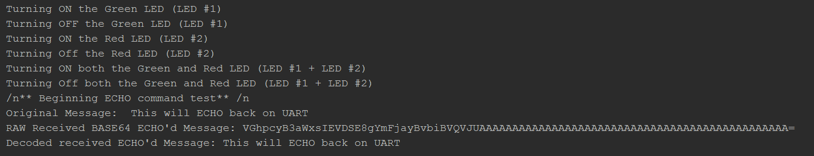

# Tutorial - Proxy Interaction Basics

This tutorial will introduce how to command a local (USB-UART) Faraday device using the Proxy server interface. Several key commands are used although many more exist within the FardayCommands module.

The example tutorial code focuses on how to:

* Send local device GPIO commands (LEDs)
* Send an "ECHO" command that echos UART payload data back to the host computer

> NOTE: All commands are checked for corruption by the CC430 prior to execution but they are not currently acknowledged or garenteed to be received.

### Prerequisites
* Properly configured and connected proxy
  * Single Faraday

#Running The Tutorial Example Script

## Configuration

* Open `configuration-template.ini` with a text editor
* Update `CALLSIGN` Replace ```REPLACEME``` to match the callsign of the Faraday unit **as assigned** in proxy
* Update `NODEID` to match the callsign node ID of the Faraday unit **as assigned** in proxy
* Save the file as `configuration.ini`


## Tutorial Output Examples

below is a screen-shot of the partial output of the tutorial script when run in a python interpreter (PyCharm). Be sure to look at the two LED's on Faraday as the script is runing to observe them turing ON and off.

> Note: GPIO's being commanded may be recieving other commands and not work as intended if multiple programs are controlling a single GPIO (i.e. RED due to RF TX indication)





# Code Overview

## Code - Toggle GPIO's (LEDs) Predefined Functions

The Faraday command module object pre-defines many common actions such as turning ON/OFF the on-board LED's. Using `faraday_cmd.CommandLocalGPIOLED1On()` will command the LED #1 to an ON state and light up the LED. Alternatively `faraday_cmd.CommandLocalGPIOLED1Off()` turns the LED OFF.

`faraday_cmd.CommandLocalGPIOLED1On()` returns a completed command packet ready to be sent to the local device over the proxy interface (UART) and must be sent over the correct UART service port (PORT 2) for the command application running on Faraday's CC430. This is predefined as the class variable `faraday_1.CMD_UART_PORT`.

 `faraday_1.POST()` will use the RESTful API of the Proxy Interface to POST data (our command packet) to a specified local device (`local_device_callsign`,`local_device_node_id`). The returned command packet in the tutorial example code is contained in the global variable `command`.

The sleep time is only used so that each LED state is clearly visible to the user.


```python
##############
## TOGGLE GPIO
##############
#Turn LED 1 ON LOCAL
command = faraday_cmd.CommandLocalGPIOLED1On()
faraday_1.POST(local_device_callsign, local_device_node_id, faraday_1.CMD_UART_PORT, command)
time.sleep(1)

#Turn LED 1 OFF LOCAL
command = faraday_cmd.CommandLocalGPIOLED1Off()
faraday_1.POST(local_device_callsign, local_device_node_id, faraday_1.CMD_UART_PORT, command)

#Turn LED 2 ON LOCAL
command = faraday_cmd.CommandLocalGPIOLED2On()
faraday_1.POST(local_device_callsign, local_device_node_id, faraday_1.CMD_UART_PORT, command)
time.sleep(1)
```

## Code - Toggle GPIO's (LEDs) Bitmask

The previous code used pre-defined functions for toggling GPIO and left LED #2 ON. Those predefined functions are actually just providing an abstraction of the raw command for GPIO bitmask control. The GPIO bitmask control is part of the Command Application and provides both ON/OFF control of many GPIO in a single command while also guarding potentially damaging GPIO from being accidently changed (i.e. removes ability to manually toggle the RF amplifier control GPIO).

The Python module function `faraday_cmd.CommandLocalGPIO()` contains 6 function arguments:

* 3 function arguments for commanding GPIO ports 3, 4, 5 pins ON
* 3 function arguments for commanding GPIO ports 3, 4, 5 pins OFF

If any bits are HIGH (1) in the bitmask bytes then that respective pin will be toggled ON (HIGH), if a bit is left LOW (0) then no action will take place and the bit will remain in it's current HIGH/LOW state.

**For Example:**

`faraday_cmd.CommandLocalGPIO(BIT1, 0, 0, 0, BIT3, 0)`

* Toggles PORT 3 BIT 1 pin HIGH
* Toggles PORT 4 BIT 3 pin LOW

Bitwise operations are possible to simplified and consolidate the syntax to command multiple GPIO's.

`faraday_cmd.CommandLocalGPIO(BIT1|BIT5|BIT6, 0, 0, 0, 0, 0)`

* Toggles PORT 3 BIT 1, BIT 5, and BIT 6 pins HIGH


```python

#Turn LED 2 OFF LOCAL
command = faraday_cmd.CommandLocalGPIO(0, 0, 0, gpioallocations.LED_2, 0, 0) #This examples how the non predefined LED GPIO commanding is created. Multiple GPIO's can be toggled at once using ||'s
faraday_1.POST(local_device_callsign, local_device_node_id, faraday_1.CMD_UART_PORT, command)
time.sleep(1) #Delay so it is obvious that both LED's turn on at the same time in the next command

#Turn Both LED 1 and LED 2 ON simultaneously
command = faraday_cmd.CommandLocalGPIO((gpioallocations.LED_1|gpioallocations.LED_2), 0, 0, 0, 0, 0)
faraday_1.POST(local_device_callsign, local_device_node_id, faraday_1.CMD_UART_PORT, command)
time.sleep(1)

#Turn Both LED 1 and LED 2 OFF simultaneously
command = faraday_cmd.CommandLocalGPIO(0, 0, 0, (gpioallocations.LED_1|gpioallocations.LED_2), 0, 0)
faraday_1.POST(local_device_callsign, local_device_node_id, faraday_1.CMD_UART_PORT, command)
```
## Code - Command ECHO

A simple ECHO like command is programmed into Farday's command program that will simply send the supplied data payload back to the host computer. The ECHO command only accepts a single UART transport packet so it is limited in size to the 124 byte maximum transmissible unit of the current UART network stack.

This command example is pretty self explaining and simply sends the string `"This will ECHO back on UART"` to the local Faraday device and retrieves, parses, and displays the ECHO'd packet. Note the padding bytes likely visible due to fixed length UART transport packet formatting appended to the original message. Also, this command accepts binary data values (not just ASCII string text)!

```python
###############
## ECHO MESSAGE
###############
#Use the general command library to send a text message to the Faraday UART "ECHO" command. Will only ECHO a SINGLE packet. This will send the payload of the message back (up to 62 bytes, this can be updated in firmware to 124!)
originalmsg = "This will ECHO back on UART" #Cannot be longer than max UART payload size!
command = faradaycommands.commandmodule.create_command_datagram(faraday_cmd.CMD_ECHO, originalmsg)
faraday_1.POST(local_device_callsign, local_device_node_id, faraday_1.CMD_UART_PORT, command)

#Retrive waiting data packet in UART Transport service number for the COMMAND application (Use GETWait() to block until ready or return False).
rx_echo_raw = faraday_1.GETWait(local_device_callsign, local_device_node_id, faraday_1.CMD_UART_PORT, sec_timeout = 3)  # Wait for up to 3 seconds for data to arrive

#Now parse data again
b64_data = rx_echo_raw[0]['data']
echo_decoded = faraday_1.DecodeRawPacket(b64_data)

#Display information
print "Original Message: ", originalmsg
print "RAW Received BASE64 ECHO'd Message:", b64_data
print "Decoded received ECHO'd Message:", echo_decoded #Note that ECHO sends back a fixed packed regardless. Should update to send back exact length.

```


## Tutorial Output Example

below is a screenshot of the partial output of the tutorial script when run in a python interpreter (PyCharm).


The padding bytes are clearly visible appended to the end of the returned ECHO'd string. 

#Bonus Excersize

* Modify the the example script to remove the padding bytes and display only the original ECHO'd string.
* Can you do this variably given any string length using only the packets sent and received?
  * *Hint: [Application layer](https://en.wikipedia.org/wiki/OSI_model) packet [encapsulation](https://en.wikipedia.org/wiki/Encapsulation_(networking))*

