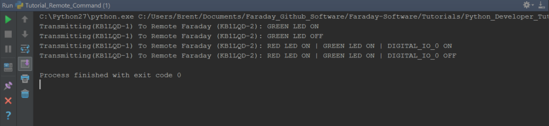

# Tutorial - Remote RF Command

This tutorial introduces basic wireless commanding between two Faraday devices.

### Prerequisites
* Properly configured and connected proxy
  * x1 Faraday connected to local computer
  * x1 Faraday powered within radio range (can be USB powered on same computer)
 
> Note: Keep the units separated a few feet apart and ensure the RF power settings are below ~20 to avoid de-sensing the CC430 front end receiver!

# Running The Tutorial Example Script

## Configuration

* Open `commanding-remote.sample.ini` with a text editor
* **Transmitter**
  * Update `REPLACEME` from `CALLSIGN` to match the callsign of the Faraday unit **as assigned** in proxy
  * Update `REPLACEME` from `NODEID` to match the callsign node ID of the Faraday unit **as assigned** in proxy
* **Receiver**
  * Update `REPLACEME` from `CALLSIGN` to match the callsign of the remote Faraday unit as configured in the remote receiver Faraday's FLASH memory
  * Update `REPLACEME` from `NODEID` to match the node ID of the remote receiver Faraday's  FLASH memory configuration
* Save the file as `commanding-remote.ini`

> NOTE: Ideally the proxy assigned callsign/ID matches the unit device configuration but this is not controlled or required and care should be taken to ensure the information is correctly configured.

```python
[DEVICES]
UNITS=2

; Transmitter - This should match the connected Faraday unit as assigned in Proxy configuration
UNIT0CALL=REPLACEME
UNIT0ID= REPLACEME

; Receiver - This should match the programmed callsign of the remote Faraday device to be commanded (receive)
UNIT1CALL=REPLACEME
UNIT1ID= REPLACEME
```


## Execute Tutorial Script

While running the tutorial script you should see the green led (LED #1) and red LED (LED #2) light up on the remote unit. During the actuation of DIGITAL_IO_0 you will measure 3.3V and 0V respectively for ON and OFF commands.



# RF Commanding Design Summary

The command functionality on Faraday is operating in an application running on Faraday itself and parses command application packets to determine actions needed. This is common between both local and RF commands however sending and RF command simply encapsulates a local command (for the remote unit) within a wireless packet transmission both address to the intended device and respective command application "port". This results in the remote device receiving a "local" command from a remote device, it knows no difference.

The `DIGITAL_IO_0` pin is a GPIO header pin that can be measured for voltage toggling but no visible effect occurs. These pins are useful to add additional functionality to your Faraday radio.

#Code Overview

## Code - Toggle LED & Digital GPIO pin 

The tutorial code below is very similar to the previous "local commanding" tutorial however you'll notice that all command destined to be executed on a remote device are commanded using the "command" number `9` (remote command) with the actual command to be execute as payload. Command `9` simply transmits a command packet to the remote device and upon reception the remote device will execute the payload (encapsulated local command packet) as a local command.

```python
################################
## TOGGLE Remote Device ++GPIO
################################

#Turn remote device LED 1 ON
print "Transmitting(" + local_device_callsign + "-" + str(local_device_node_id) + ") To Remote Faraday (" + remote_device_callsign + "-" + str(remote_device_node_id) + "): GREEN LED ON"
command = faraday_cmd.CommandLocal(9, faraday_cmd.CommandRemoteGPIOLED1On(remote_device_callsign, remote_device_node_id))
faraday_1.POST(local_device_callsign, local_device_node_id, faraday_1.CMD_UART_PORT, command)
time.sleep(1)

#Turn remote device LED 1 OFF
print "Transmitting(" + local_device_callsign + "-" + str(local_device_node_id) + ") To Remote Faraday (" + remote_device_callsign + "-" + str(remote_device_node_id) + "): GREEN LED OFF"
command = faraday_cmd.CommandLocal(9, faraday_cmd.CommandRemoteGPIOLED1Off(remote_device_callsign, remote_device_node_id))
faraday_1.POST(local_device_callsign, local_device_node_id, faraday_1.CMD_UART_PORT, command)
time.sleep(0.5)

#Turn both LED 1, LED2, and DIGITAL_IO_0 ON, This requires a slightly more low level function and bitmask. Prior function were high level abstractions of this command
print "Transmitting(" + local_device_callsign + "-" + str(local_device_node_id) + ") To Remote Faraday (" + remote_device_callsign + "-" + str(remote_device_node_id) + "): RED LED ON | GREEN LED ON | DIGITAL_IO_0 ON"
command = faraday_cmd.CommandLocal(9, faraday_cmd.CommandRemoteGPIO(remote_device_callsign, remote_device_node_id, gpioallocations.LED_1 | gpioallocations.LED_2 | gpioallocations.DIGITAL_IO_0, 0, 0, 0, 0, 0))
faraday_1.POST(local_device_callsign, local_device_node_id, faraday_1.CMD_UART_PORT, command)
time.sleep(1)

#Turn both LED 1 and DIGITAL_IO_0 OFF
print "Transmitting(" + local_device_callsign + "-" + str(local_device_node_id) + ") To Remote Faraday (" + remote_device_callsign + "-" + str(remote_device_node_id) + "): RED LED OFF | GREEN LED OFF | DIGITAL_IO_0 OFF"
command = faraday_cmd.CommandLocal(9, faraday_cmd.CommandRemoteGPIO(remote_device_callsign, remote_device_node_id, 0, 0, 0, gpioallocations.LED_1 | gpioallocations.LED_2 | gpioallocations.DIGITAL_IO_0, 0, 0))
faraday_1.POST(local_device_callsign, local_device_node_id, faraday_1.CMD_UART_PORT, command)
time.sleep(0.5)
```

# Troubleshooting

The addition of wireless communications invites more chances for setup and reliability issues. Below are a few quick items to check if you are experiencing problems.

**Remote Callsign/ID**

Check that the correct callsign and ID number of the remote device is correct (as programmed) or the MAC layer protocol will not allow the remote unit to accept the command. All commands accepted by a unit over RF must match be properly addressed.

**RF Power - De-sensing**

Faraday is actually quite sensitive and having a high power signal transmit between two close units can cause the receiving device to not hear the transmission. This is called radio de-sensing. The solution is to either turn the power down or increase the distance between transmitter and receiver. Typically for a separation of a foot or two with a power setting under 20 works well.
