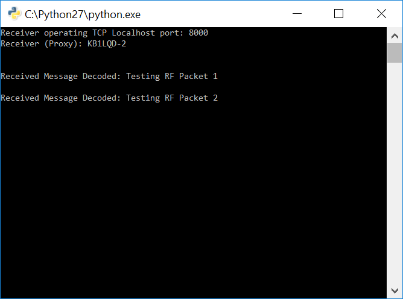

# Tutorial - Experimental RF Command

This tutorial introduces wireless data transmission between two Faraday units. The example program(s) uses the "Experimental RF Packet Forward" Faraday command application command. This command sends a single data packet (payload) as supplied from the local device (transmitter) to a remote device (receiver) using a wireless command transmission. This is "experimental" because it is not optimized and purely for learning/debugging but it introduces key concepts that are used in more advanced Faraday data transmission programs. ***This enables simple proxy (Python) packet protocol experimentation without the need for CC430 programming!***

> This code makes up for its extreme inefficiency with its simplicity. A throughput of ~2kBps was measured using this tutorial program operating at a datarate of 38.4kbaud sending 1kB of data. Inefficient but still pretty fast for amateur radio!

Although there is limited optimization and flexibility available this provides the educational basis for:

* Single data packet transmissions
* Text message programs
  * [Packet fragmentation](http://www.tech-faq.com/packet-fragmentation.html), [packet sequencing](https://www.wireshark.org/docs/wsdg_html_chunked/ChDissectReassemble.html),flow control [general protocol state machines (PDF)](http://courses.cs.vt.edu/~cs5516/spring03/slides/reliable_tx_1.pdf)
* File transfer
  * [ARQ protocols](https://en.wikipedia.org/wiki/Automatic_repeat_request)

There are two transmitter scripts provided that are received by a single receiver script.
 
* Transmit a saved variable 
* Transmit user input data


#Running The Tutorial Example Script

## Start The Proxy Interface

Following the [Configuring Proxy](../../0-Welcome_To_Faraday/Configuring_Proxy/) tutorial configure, start, and ensure a successful connection to **BOTH** locally (USB) connected Faraday digital radios.

## Edit Local/Remote Device Information

###Transmit Python Script(s)

The tutorial transmit python scripts (`Tutorial_Exp_RF_Packet_TX.py` and `Tutorial_Exp_RF_Packet_TX-User-Input.py`) variables listed below hold the local and remote Faraday device callsign/ID numbers. The local device communicates through the proxy interface and regardless of actual assigned callsign/ID the variables must match that assigned by the *"proxy.ini"* file. The remote device callsign/ID variable is used to address the RF packet and must match that of the remote unit device configuration to be communicated with.

> NOTE: Ideally the proxy assigned callsign/ID matches the unit device configuration but this is not controlled or required and care should be taken.


```python
#Local device information
local_device_callsign = 'KB1LQD'
local_device_node_id = 1

#Remote device information
remote_callsign = 'KB1LQD'
remote_id = 2
```

### Receiver Python Script

Update the receiving python script `Tutorial_Exp_RF_Packet_RX.py` local Faraday device callsign and ID number connection information to interact with the intended proxy device for receive.

```python
#Local device information
local_device_callsign = 'kb1lqd'
local_device_node_id = 2
```

## Start The Receiver

Run the `Tutorial_Exp_RF_Packet_RX.py` script and when properly conneted to the proxy Faraday device a terminal propmt like below should appear:


## Execute Tutorial Script `Tutorial_Exp_RF_Packet_TX.py`

Simply running this script will transmit two predefined data messages (ASCII) one after the other to the receiver and be displayed!




> If you do not see received packets see the troubleshooting section below


## Execute Tutorial Script `Tutorial_Exp_RF_Packet_TX-User-Input.py`

The "User Input" transmitter program will open a prompt (left) when run thats asks for you to enter text to be transmitted to and displays on the receiver (right)  terminal.


Type in any message (keep in legal for Part 97!) to the transmitter prompt the is less than 42 characters (bytes) long and press enter to transmit. You should see the receiver print the message!


Congratulations, you just transmitted your first simple text message using Faraday!

> If you do not see received packets see the troubleshooting section below

#Code Overview - Receiver


## Code - Receiver Loop

The receiver code is extremely basic and simple loops while checking for a new data from UART service port #2. The `faraday_1.GETWait()` is run on each loop iteration and when data has been received it decodes the proxy BASE64 and prints the raw data payload to the terminal prompt. Setting `data = None` is important so that the function only prints NEW data as received, `faraday_1.GETWait()` returns `None` when no data has been retrieved from proxy.

```python
#Print debug information about proxy port listening
print "Receiver operating TCP Localhost port:", faraday_1.FLASK_PORT

#Setup variables for receiving
data = None

#While loop to wait for reception of data packet from experimental message application
while(1):
    #Wait until there is new data on the message application port OR timout
    data = faraday_1.GETWait(local_device_callsign, local_device_node_id, PROXY_MESSAGE_EXPERIMENTAL_PORT, 2)

    #Check if data is False (False means that the Get() function timed out), if not then display new data
    if (data != None) and (not 'error' in data):
        #print "Received Message RAW", repr(data[0]['data'])
        print "Received Message Decoded:", faraday_1.DecodeRawPacket(data[0]['data'])

        #Set data = False so that the function loop can properly wait until the next data without printing last received data over and over
        data = None
```

## Code - Transmitter (`Tutorial_Exp_RF_Packet_TX.py`)

The transmitter code that sends a predefined string variable to the receiver is straight-forward programatically. The predefined experimental RF packet forward command is accessed using `faraday_cmd.CommandLocalExperimentalRfPacketForward()` from the `faradaycommands.py` module. The message is simple placed into this function as a data payload to the intended remote receiving Faraday device.

Two messages are send sequentially, `"Testing RF Packet 1"` and `"Testing RF Packet 2"` with not timing constraints (flow control) between them. Faraday is fast enough to buffer both incoming packets and transmit them. 

```python
print "Connecting to proxy on PROXY device:", local_device_callsign + '-' + str(local_device_node_id)
print "Transmitting to device:", remote_callsign + '-' + str(remote_id)

#Use the predefined experimental message command (singled packet) function to send an RF message to a remote unit
message = "Testing RF Packet 1"
command = faraday_cmd.CommandLocalExperimentalRfPacketForward(remote_callsign, remote_id, message)
print "Transmitting message:", message
faraday_1.POST(local_device_callsign, local_device_node_id, faraday_1.CMD_UART_PORT, command)

message = "Testing RF Packet 2"
command = faraday_cmd.CommandLocalExperimentalRfPacketForward(remote_callsign, remote_id, message)
print "Transmitting message:", message
faraday_1.POST(local_device_callsign, local_device_node_id, faraday_1.CMD_UART_PORT, command)
```


# Troubleshooting

The addition of wireless communications invites more chances for setup and reliability issues. Below are a few quick items to check if you are not able to runing the tutorial script is not commanding the remote unit correctly.

**Remote Callsign/ID**

Check that the correct callsign and ID number of the remote device is correct (as programmed) or the MAC layer protocol will not allow the remote unit to accept the command. All commands accepted by a unit over RF must match be properlly addressed.

**RF Power - Desensing**

Faraday is actually quite sensitive and having a high power signal transmit between two close units can cause the receiving device to not hear the transmission. This is called radio de-sensing. The solution is to turn the power down, typically for a foot or two I've found a setting under 20 works well.

**Payload Data Too Long**

This simple implementation is limited to a maximum of 42 Bytes of payload data. Exceeding this will cause the transmission to fail.

**General Noise/Corruption**

This simplistic protocol has no error detection or correction. If a packet was not receiver simply retry several times.


#See Also


