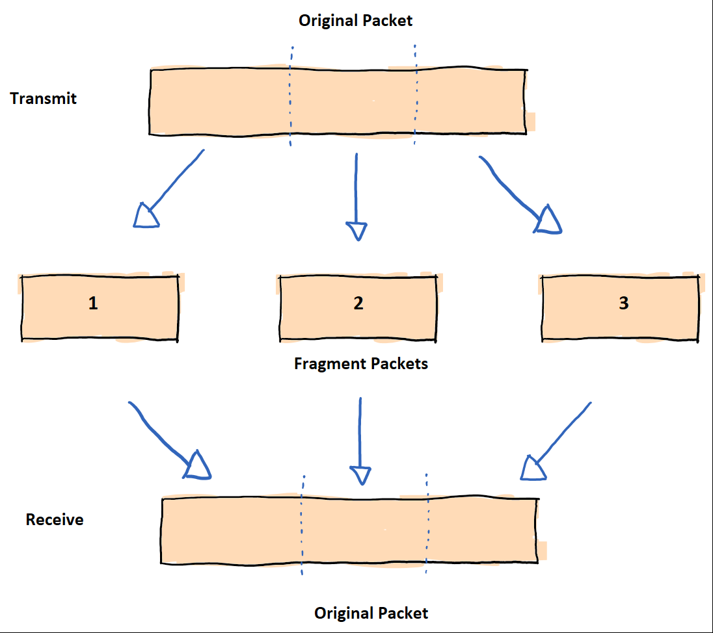
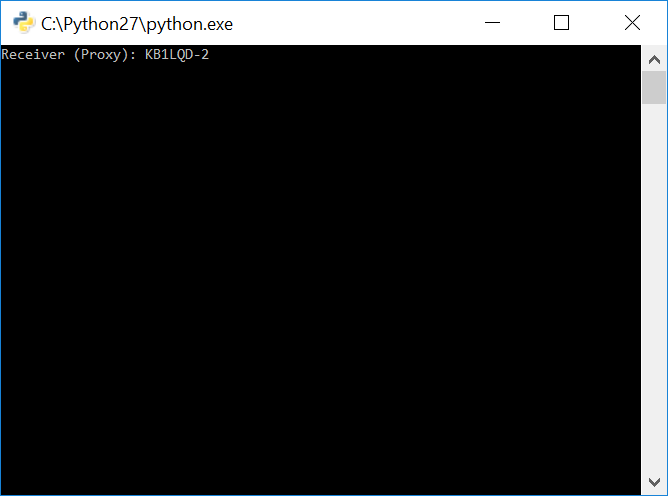
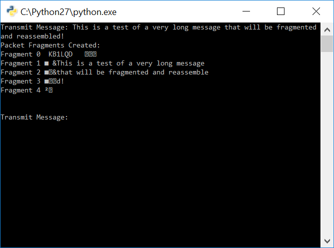
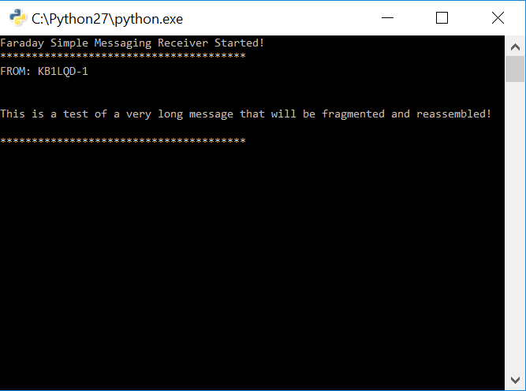
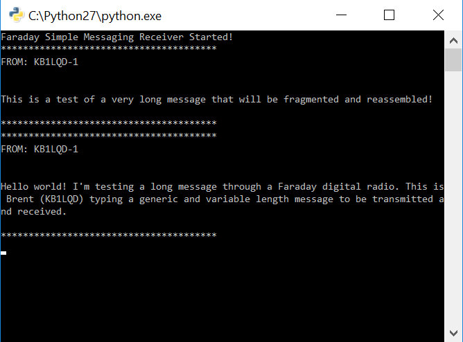
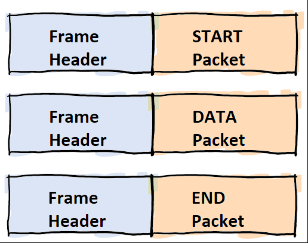
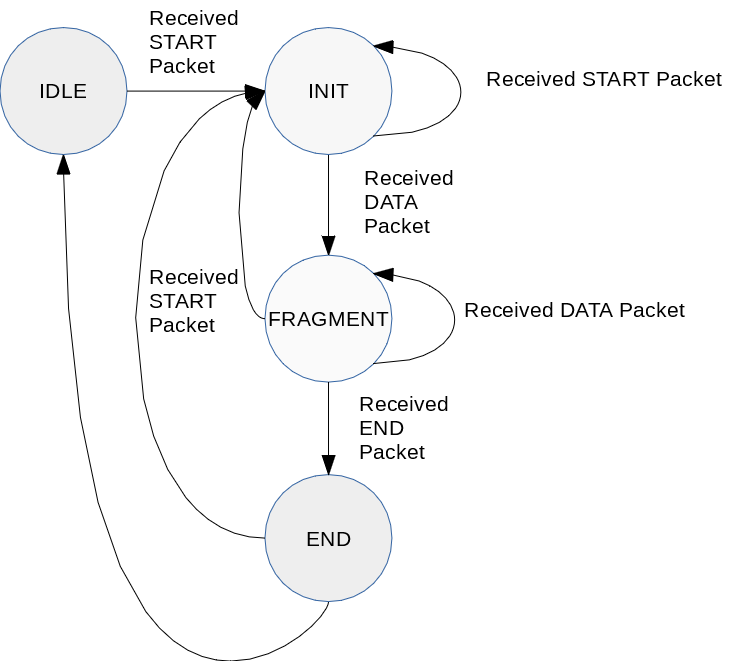
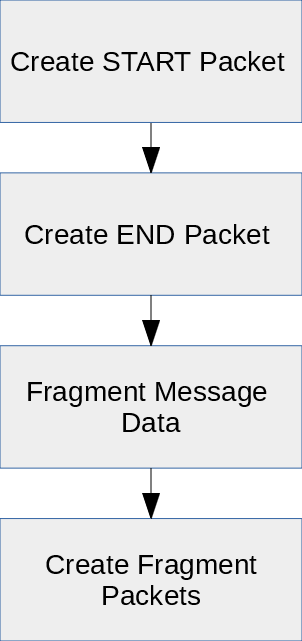
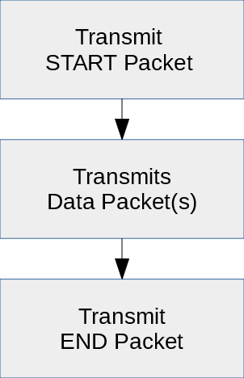

# Tutorial - Simple Text Messaging Application Using Experimental RF Command

As shown in the previous tutorial it is possible to send short packets between two Faraday's using only python code and use of the "Experimental RF Packet Forward" functionality. Transmitting messages longer than a single packet is not possible without introducing the concent of packet fragmentation and encapsulation. ***This tutorial program will allow the transmission and reception of messages larger than a single packet between two Faraday devices using RF transmissions.***

Packet fragmentation breaks a large packet into smaller "chunks" for transmission, the receiver reassembles these chunks of data piece by piece until the original packet has been recreated. 



Packet encapsulation is the act of placing one packet (or portions of a packet) into another packet as data payload. In order to reassemble correctly several key issues need to be addressed:

* Ordering of fragmented packets needs to be maintained
* Receiver must know when to start and stop reassembling a fragmented packet

> This simplistic fragmentation protocol uses a single byte in the packet protocol to indicate the number of packets to expect. This means that up to 256 fragments are usable. There are methods that allows abritrarly length but this was a sufficiently large and simple constraint.

### Prerequisites
* Properly configured and connected proxy
  * x2 Faraday connected to local computer
 
> Note: Keep the units seperated a few feet apart and ensure the RF power settings are below ~20 to avoid desensing the CC430 front end receiver!

> Note: Until proxy auto-configuration functionality is added it is possible that proxy's assigned callsign is different than the units actual configuration callsign. Please keep these matching unless you know what you're doing.

An example proxy.ini with two units connected is shown below.

```Python
[FLASK]
HOST=127.0.0.1
PORT=8000

[PROXY]
UNITS=2

[UNIT0]
CALLSIGN = KB1LQD
NODEID = 1
COM = COM106
BAUDRATE = 115200
TIMEOUT = 5

[UNIT1]
CALLSIGN = KB1LQD
NODEID = 2
COM = COM112
BAUDRATE = 115200
TIMEOUT = 5
```

#Running The Tutorial Example Script

## Configuration

* Open `configuration-template.ini` with a text editor
* Transmitter
  * Update `CALLSIGN` Replace ```REPLACEME``` to match the callsign of the Faraday unit **as assigned** in proxy
  * Update `NODEID` to match the callsign node ID of the Faraday unit **as assigned** in proxy
* Receiver
  * Update `CALLSIGN` Replace ```REPLACEME``` to match the callsign of the remote Faraday unit as configured in the devices FLASH memory configuration
  * Update `NODEID` to match the callsign of the remote Faraday unit as configured in the devices FLASH memory configuration
* Save the file as `configuration.ini`

> NOTE: Ideally the proxy assigned callsign/ID matches the unit device configuration but this is not controlled or required and care should be taken.

```python
[DEVICES]
UNITS=2

; Transmitter - This should match the connected Faraday unit as assigned in Proxy configuration
UNIT0CALL=REPLACEME
UNIT0ID= REPLACEME

; Receiver - This should match the programmed callsign of the remote Faraday device to be commanded (receive)
UNIT1CALL=REPLACEME
UNIT1ID= REPLACEME
```

##Transmit Python Script(s)

There are two transmitter scripts provided that are used to send UART data to the intended transmitter Faraday which in turn forwards that data over a wireless transmission.

* `tx.py` - Transmits a hardcoded message
* `tx_user_input.py` - Transmits user input text


## Receiver Python Script

The `rx.py` script is used to create the "receiver" for the received data packet(s) from the experimental packet forward command application "port". It continuously queries proxy for new packets on this port and if so it retrieves, parses, and displays them.

## Run The Receiver Program `rx.py`

Execute the `rx.py` program. This will start a terminal prompt that is waiting for messages to receive from the receiving Faraday through the proxy interface.



## Run The (Basic) Transmitter Program `tx.py`

Execute the `tx.py` program to transmit a long (larger than a single 41 byte Experimental RF packet forward packet)fixed length string to the receiver.

The message saved (feel free to edit you're own message in!) is `This is a test of a very long message that will be fragmented and reassembled!`. 



The transmission propmt displays the fragment packets being transmitted. The first and last fragments are always the START and STOP packets.

After transmission observe the receiver terminal, the message should have been received!



Although this message was split between 2 data packets, START, and an END packet the message was reasembled.

> There is no error correction in this simple program, if corruption or loss occurs the message contents will not be 100% correct.

## Run The User Input Transmitter Program `tx_user_input.py`

This transmitter program accepts user text input and after hitting the ENTER key to initiate a transmission.



#Theory Of Operation

## Program Structure

The transmit and receive messaging funcitons are provided by two class objects `MsgStateMachineTx()` and `MessageAppRx()` respectively in the `faradaymsg.py` script. These objects contain the fragmentation, sequencing, and other functions that create the simple messaging protocol. 

## Fragmentation Packets

Fragmentation of the packets to be transmitted must be accompanied by a method for the receiver to know when a new message has started, stopped, and the order of the received fragments. Three packet types have been created and are encapsulated inside a simple fixed length "Frame" (header) that indicates which packet type was received.



* **START Packet:** Indicates the beginning of a new message to receive and contains information such as source station ID and expected length/fragmentation packets to receive.

* **DATA Packet:** This packet contains one fragmented packet as a payload and is used each time as the a single fragmentation is transmitted until completed. It contains a simple header that indicates the sequence ordering for reassembly.

* **END Packet:** Indicates the message transmission has completed and contains a final message size in bytes. The message size in bytes is a very simple error detection method although not very reliable (it will detect lost packets).

in `class MsgStateMachineTx(object)`:

``` Python
        # Frame Definitions
        self.pkt_datagram_frame = struct.Struct('1B 40s')  # Fixed
        self.pkt_start = struct.Struct('9s 3B')  # Fixed
        self.pkt_data = struct.Struct('2B 38s')  # Variable  Data Length
        self.pkt_end = struct.Struct('1B')  # Fixed
```

## Receiver - Assembling Fragmented Data
The receiver program class is a simple state machine that detects and reassembles fragmented data messages. The state machine states are listed below.

* **IDLE:** Program waits here until a new message to receive is detected (START packet)

* **INIT:** Message buffer is cleared and fragmentation counters reset 

* **FRAGMENT:** The state operated during reception of all sequential fragmentation packets and reassembly

* **END:** Indicates the last packet has been received and to complete reassembly of message and return to idle



The code block below is from the `faraday_msg.py` receiver class `MessageAppRx(object)` and the function `parsepacketfromdatagram()` performs the parsing of the recieved packets. The state machine diagram above was implemented into code as shown below. 

> Note: The state machine implementation is not strong and allows free movement to any state (i.e. END packet directly following a START packet). This may cause unintended operation in off nominal situations.

```python
 def parsepacketfromdatagram(self, datagram):    
        unpacked_datagram = self.pkt_datagram_frame.unpack(datagram)
        packet_identifier = unpacked_datagram[0]
        packet = unpacked_datagram[1]
        try:
            # Start Packet
            if packet_identifier == 255:
                unpacked_packet = self.pkt_start.unpack(packet[0:12])
                # print unpacked_packet
                self.faraday_Rx_SM.frameassembler(255, unpacked_packet)
                return None
            # Data Packet
            if packet_identifier == 254:
                unpacked_packet = self.pkt_data.unpack(packet[0:41])
                # print unpacked_packet
                self.faraday_Rx_SM.frameassembler(254, unpacked_packet)
                return None
            # END Packet
            if packet_identifier == 253:
                unpacked_packet = self.pkt_end.unpack(packet[0])
                # print unpacked_packet
                message_assembled = self.faraday_Rx_SM.frameassembler(253, unpacked_packet)
                return message_assembled
        except Exception, err:
            print "Fail - Exception", Exception, err
```
The receiver program `rx.py` is constantly looping and looking for new data to obtain from the proxy interface. When available data is retrieved and then parsed through the simple state machine.

```python
def rxmsgloop(self, local_callsign, local_callsign_id, uart_service_port_application_number, getwaittimeout):
        data = None
        data = self.faraday_Rx.GETWait(str(local_callsign).upper(),
                                       int(local_callsign_id),
                                       uart_service_port_application_number,
                                       getwaittimeout)
        if (data is not None) and ('error' not in data):
            for item in data:
                datagram = self.faraday_Rx.DecodeRawPacket(item['data'])
                # All frames are 42 bytes long and need to be extracted from the much larger UART frame from Faraday
                datagram = datagram[0:42]
                message_status = self.parsepacketfromdatagram(datagram)
                if message_status is None:
                    return None  # Partial fragmented packet, still receiving
                else:
                    return message_status  # Full packet relieved!
```

## Transmitter - Fragmenting Data

The transmitter class operations are very straight forward in their operational flow to create the needed frames/packets.



The code block below shows the `tx.py` script performing the actions above:

```python
# Create message to transmit
message = 'This is a test of a very long message that will be fragmented and reassembled!'

# Create message fragments
faraday_tx_msg_sm.createmsgpackets(local_device_callsign, local_device_node_id, message)

#Iterate through start, stop, and data fragment packets and transmit
for i in range(0, len(faraday_tx_msg_sm.list_packets), 1):
    print "TX:", repr(faraday_tx_msg_sm.list_packets[i])
    faraday_tx_msg_object.transmitframe(faraday_tx_msg_sm.list_packets[i])
```

The function `createmsgpackets()` in `faraday_msg.py` transmitter object `MsgStateMachineTx()` performs all of the packet and fragment creation.

```python
    def createmsgpackets(self, src_call, src_id, msg):
        # Ensure callsign and ID are formatted correctly
        src_call = str(src_call).upper()
        src_id = int(src_id)

        # Create START Packet
        msg_start = self.createstartframe(src_call, src_id, len(msg))
        msg_start = self.pkt_datagram_frame.pack(self.MSG_START, msg_start)

        # Create END Packet
        msg_end = self.createendframe(len(msg))
        msg_end = self.pkt_datagram_frame.pack(self.MSG_END, msg_end)

        # Create DATA Packet(s)
        list_msg_fragments = self.fragmentmsg(msg)
        list_data_packets = []

        del list_data_packets[:]  # Remove all old indexes

        for i in range(0, len(list_msg_fragments), 1):
            data_packet = self.createdataframe(i, list_msg_fragments[i])
            print "Pre-Pack:", repr(data_packet), len(data_packet)
            data_packet = self.pkt_datagram_frame.pack(self.MSG_DATA, data_packet)
            print "Post-Pack:", repr(data_packet), len(data_packet)
            list_data_packets.append(data_packet)

```

In the `faraday_msg.py` transmitter object the `fragmentmsg()` breaks the larger message into smaller sized packets that are within the MTU of the end-to-end network stack.

```python
    def fragmentmsg(self, msg):
        list_message_fragments = [msg[i:i + self.MAX_MSG_DATA_LENGTH] for i in
                                  range(0, len(msg), self.MAX_MSG_DATA_LENGTH)]
        for item in list_message_fragments:
            print item, "Frag Length", len(item)
        print repr(list_message_fragments)
        return list_message_fragments
```

It should be noted that after the creation of all START, DATA, and END packets the program creates a list containing all packets in the correct order for transmisssion.


## Transmitter - Transmitting Fragmented Data

The transmitter program then transmits the packets in the specific order to match the receiver state machine operational flow.



The transmitter script interates through a list of packets (already in the correct transmission order) and transmits them. There is no flow control or error correction.

```python
#Iterate through start, stop, and data fragment packets and transmit
for i in range(0, len(faraday_tx_msg_sm.list_packets), 1):
    print "TX:", repr(faraday_tx_msg_sm.list_packets[i])
    faraday_tx_msg_object.transmitframe(faraday_tx_msg_sm.list_packets[i])
```

Transmission is performed using the standard `proxy.py` interface POST.

```python
def transmitframe(self, payload):
        self.command = self.faraday_cmd.CommandLocalExperimentalRfPacketForward(self.destination_callsign,
                                                                                self.destination_id,
                                                                                payload)
        print "Transmitting message:", repr(payload), "length:", len(payload)
        self.faraday_1.POST(self.local_device_callsign, self.local_device_node_id, self.faraday_1.CMD_UART_PORT,
                            self.command)
```


#Apendix

## Frame and Packet Definitions
Placeholder


