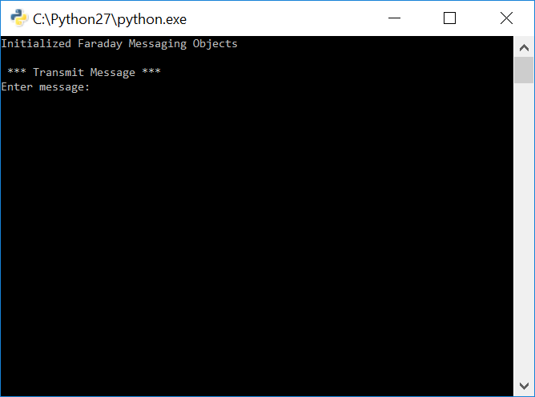
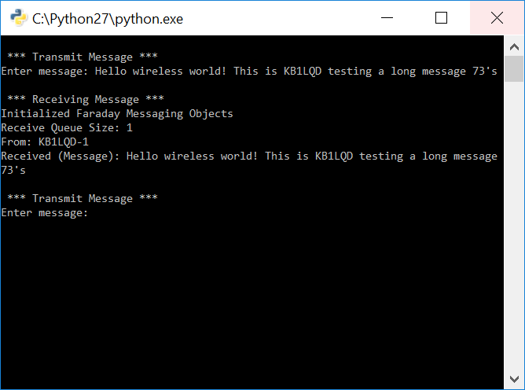

# Tutorial - Simple Text Messaging Class Object

The previous tutorial created a simple messaging application that utilized the Faraday  proxy interface and directly coupled a simple user interface. Proper applications should implement a more modular approach by separating the user interface from core application, ideally using a RESTful interface (FLASK). This tutorial presents an example program that utilizes a transmit/receive threaded class object providing a python interface and buffer, a useful step towards a fully FLASK interface!


#Running The Tutorial Example Script

## Start The Proxy Interface

Following the [Configuring Proxy](../../0-Welcome_To_Faraday/Configuring_Proxy/) tutorial configure, start, and ensure a successful connection to **BOTH** locally (USB) connected Faraday digital radios.


## Edit `message_application_example.py` Callsigns and IDs

Edit the example applications callsign and ID numbers with those of your Faraday devices and proxy application assignments.

> NOTE: This application assumes that the proxy assigned callsigns match those of the units. This is usually the case and hopefully in the future dynamic allocation will resolve this potential discrepensy.

The code block below shows the two Faraday devices `KB1LQD-1` and `KB1LQD-2` assigned. The variables are not case sensitive.

```python
#Unit designation constants
# NOTE: Assumes proxy assignent is equal to the real unit programmed callsigns and IDs
unit_1_callsign = 'kb1lqd'
unit_1_callsign_id = 1
unit_2_callsign = 'kb1lqd'
unit_2_callsign_id = 2
```

## Run `message_application_example.py`

Run the application, you'll see a screen ask for the message you'd like to transmit.



Type the message you'd like to transmit. This message will transmit from `Unit 1` and be received on `Unit 2`. Hit the enter key to transmit, you should see the red LED blink on `Unit 1` indicating transmissions are occuring followed shortly by the prompt displaying the received message. The propmt will ask for the next message to send.



Congratulations! We've taken a mighty step to creating a powerful transmit/recieve object that allows simple direct messaging between Faraday digital radios. 

## Ideas

Ideas for the reader to experiment with the example program.

* Swap `Unit 1` and `Unit 2` transmit and receive operation in the example program
* Modify the example code to example sending more than one message prior to receiving. This will build up messages in the queue.
* Write an automated response message to transmit back after reception.
* Break the `message_application_example.py` application into two programs each dedicated to a specific device. Enable transmit/receive between two units generically.

#Code Overview

## Code - Class Objects

Creating transmit and receive class objects allows functionality to be copied to multiple instances from a single python script. Creating a third object combining the transmit/recieve objects together in a single class allows for one object variable to perform both functions seamlessly. 

Although we haven't created a FLASK API interface yet we have created abritrary function blocks that can be glued to a Flask interface.

### Transmiter Object

The transmit object simply provides an interface where a supplied destination callsign, ID number, and payload (message) are transmitted to the inteded device using Faraday's CC430 RF modem. The `send()` function calls `faraday_tx_msg_sm.createmsgpackets()` to fragment the message into smaller packets and inserting the START and END protocol packets. `faraday_tx_msg_object.transmitframe()` simply transmits the packets.

```python
class TransmitObject(object):

    def __init__(self, local_device_callsign, local_device_node_id):
        self.local_device_callsign = local_device_callsign
        self.local_device_node_id = local_device_node_id
        # Create messaging application objects needed for transmissions
        self.faraday_tx_msg_sm = faraday_msg.MsgStateMachineTx()
        self.faraday_tx_msg_object = faraday_msg.MessageAppTx(self.local_device_callsign,
                                                              self.local_device_node_id)
        # Create receiver application object
        self.faraday_rx_msg_object = faraday_msg.MessageAppRx()
        self.rx_uart_service_port_application_number = 3
        self.GETWAIT_TIMEOUT = 2

    def send(self, dest_callsign, dest_id, payload):
        # Create message fragments
        self.faraday_tx_msg_sm.createmsgpackets(self.local_device_callsign, self.local_device_node_id, payload)

        # Iterate through start, stop, and data fragment packets and transmit
        for i in range(0, len(self.faraday_tx_msg_sm.list_packets), 1):
            # print "TX:", repr(self.faraday_tx_msg_sm.list_packets[i])
            self.faraday_tx_msg_object.transmitframe(self.faraday_tx_msg_sm.list_packets[i], dest_callsign, dest_id)
```

### Receiver Object

The reciever object must run in the background constantly looking for new data (packet fragments) received in the proxy interface buffers and perform reassembly if available. When a full message has been reconstructed it is placed into a FIFO (Queue) for retrieval.

The [Python threading module](https://pymotw.com/2/threading/) was used to run the objects `run()` function indefinietely as a seperate process. The module also allows for querying for the number of received messages waiting in the FIFO as well as a function to return the next item from it.

```python
class ReceiveObject(threading.Thread):
    def __init__(self, local_device_callsign, local_device_node_id):
        self.local_device_callsign = local_device_callsign
        self.local_device_node_id = local_device_node_id
        # Set constants
        self.rx_uart_service_port_application_number = 3
        self.GETWAIT_TIMEOUT = 0.5

        # Create receiver application object
        self.faraday_rx_msg_object = faraday_msg.MessageAppRx()
        threading.Thread.__init__(self)
        self.fifo = Queue.Queue(0)
        return

    def run(self):
        # Loop continuously through the faraday experimental RF command message application RX routine
        while True:
            rx_message_dict = self.faraday_rx_msg_object.rxmsgloop(self.local_device_callsign,
                                                                   self.local_device_node_id,
                                                                   self.rx_uart_service_port_application_number,
                                                                   self.GETWAIT_TIMEOUT)
            if rx_message_dict is not None:
                self.fifo.put(rx_message_dict)
                rx_message_dict = None
            else:
                pass  # No messages received
```


### Main Messaging Object

The object below combinds both transmit and receive objects into a single object for cleaner interactions. It is important to run the `receive.start()` to initiate the threaded process of the receiver. **This object is the main object to assign when using the simple messages application.**

```python
class MessageObject(object):
    def __init__(self, local_device_callsign, local_device_node_id):
        self.transmit = TransmitObject(local_device_callsign, local_device_node_id)
        self.receive = ReceiveObject(local_device_callsign, local_device_node_id)
        self.receive.start()
```