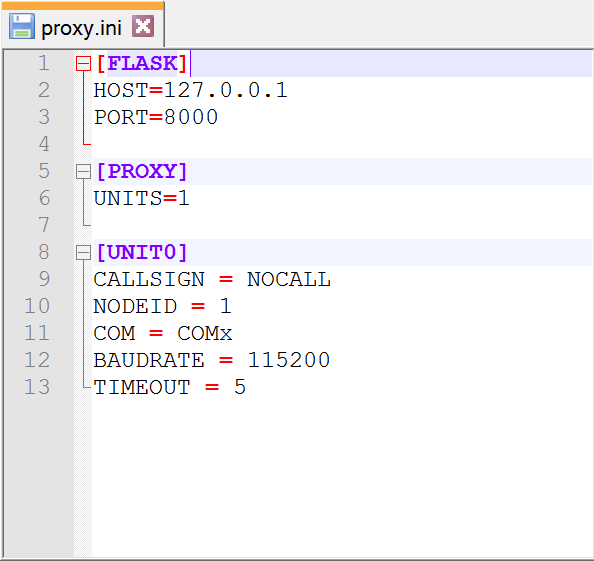
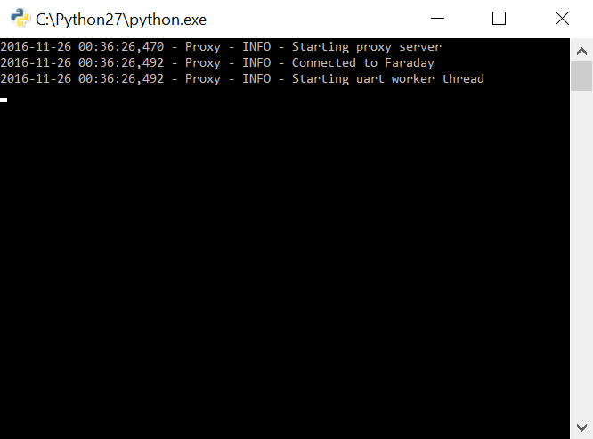
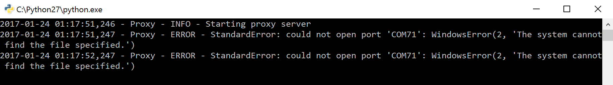

# Configuring The Faraday Proxy Interface

The [proxy interface](../../../../proxy) is a program that is used to perform all interactions with a Faraday digital radio. The diagram below illistrates this point.

## Proxy Configuration INI File 

This file contains setup variables for the proxy prior to program operation that are used to properly connect to locally attached (USB) Faraday digital radios. The proxy can connect to multiple units but for now attach a single Faraday digital radio to your computer and identify the Serial COM port address assigned to it. 

Open the `Proxy.ini` file in a text editor.

 

The image below shows the default `proxy.ini` contents as viewed in a text editor.

Update the INI file sections with your specific information or as indicated.

* **[proxy]**
  * `units=1`
* **[UNIT0]**
  * `Callsign` - Replace `NOCALL` with your callsign. Case in-sensitive but it's good practice to use all uppercase.
  * `nodeid` - `nodeid = 1` or replace with any number between 0-255. This is a unit identification number.
  * `com` - Replace with the `COMx` port assignment of the Faraday digital radio connected. Make sure to keep the "COM" prior to the number assignment.

When completed the file should look similar to the example below assuming the use of the callsign "KB1LQD" and a COM port assignment of 12.

Save the file and open (double-click) the `proxy.py` Python script to start the Farday proxy interface server.

### Successful Connection

The screenshot below shows a successful proxy connect to a Farday digital radio.

### Connection Error

The screenshot below shows the expected command prompt output if the proxy connection fails. An error is likley due to the Faraday device not actually physically connected  or the incorrect COM port assignment used in the `proxy.ini` file.

#Apendix

##Determining Faraday Device Serial COM Port Assignment (Windows)

Open "Device Manager" from the start menu and locate the "Ports (COM & LPT)" tree menu item and expand it. Identify the "USB Serial Port (COMx)" as highlighted in blue in the image below. The assigned COM port of the Faraday currently attached in the example below is COM 8 and when typed into the `proxy.ini` should follow the syntax `COM8`.

**TODO:** Update with information to find based on programed FTDI manufacturer information.

