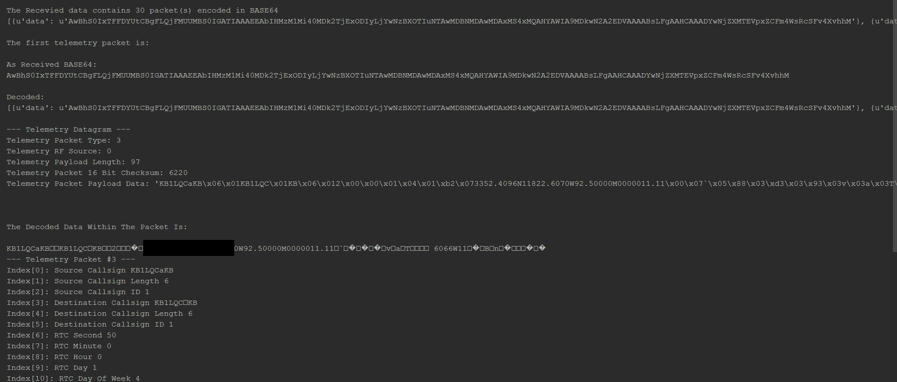

# Tutorial - Proxy Interaction Basics

This tutorial will introduce key concepts and interactions with the Faraday proxy  interface that allows communication between a host computer and local Faraday devices. The supplied proxy program is the main method of interaction with Faraday's over a local computer host connection and provides this functionality over a RESTful API on localhost.


**Proxy Interface:** The proxy  interface provides an API for the physical Faraday device.

**Applications:** Programs that interact with the Proxy Interface and provide functionalities using a Faraday device locally connected to the host computer.


**External Interface:** Programs that interact with applications to provide a user interface or API to the applications functionality.


This tutorial will focus on the interactions with Proxy directly without any applications by using POST/GET to retrieve data from a local Faraday device.

# Start The Proxy Interface

Following the [Configuring Proxy](../Tutorials/Tutorials/0-Welcome_To_Faraday/Configuring_Proxy/) tutorial configure, start, and ensure a successful connection to a locally (USB) connected Faraday digital radio.

This tutorial assumes a standard UART telemetry beacon interval rate of 5 seconds or faster. If you've configured the interval slower it is suggested to configure the Faraday device to 5 seconds or faster.

# Tutorial Output Examples

below is a screen-shot of the partial output of the tutorial script when run in a python interpreter (PyCharm). Note that some data is blacked out of this image (GPS).




# Code Overview

## Code - Python Module Imports

The Faraday Python module tools are imported using a relative PATH and to do so the PATH must be assigned using `sys.path.append()`

The Faraday tools provided:

**faradaybasicproxyio:** A simple class object used to "connect" to a local device over proxy and allow the retrieval and transmission of data.

**faradaycommands:** A predefined list of commands that control a Faraday device.

**telemetryparser:** A tool used to decode and parse retrieved telemetry application packets from a Faraday device.

 

```python
#Imports - General

import os, sys
sys.path.append(os.path.join(os.path.dirname(__file__), "../")) #Append path to common tutorial FaradayIO module

#Imports - Faraday Specific
from FaradayIO import faradaybasicproxyio
from FaradayIO import faradaycommands
from FaradayIO import telemetryparser

```

## Code - faradaybasicproxyio Tool Configuration and Program Variables

The `local_device_callsign` and `local_device_node_id` global variables in the tutorial script are variables that should be updated to match the callsign/ID of the connected Faraday device to interact with. The Python class objects are initialized and ready to provide their functionality further in the program.


```python
#Variables
local_device_callsign = 'kb1lqd'
local_device_node_id = 1

#Start the proxy server after configuring the configuration file correctly
#Setup a Faraday IO object
faraday_1 = faradaybasicproxyio.proxyio()
faraday_cmd = faradaycommands.faraday_commands()
faraday_parser = telemetryparser.TelemetryParse()
```

## Code - Retrieve Data From Proxy


`faraday_1.GETWait()` is a blocking function that waits for data in the `faraday_1.TELEMETRY_PORT` up to 10 seconds. The unit should be configured to send UART telemetry data every 5 seconds, if data is not already waiting in the UART (Telemetry) service port then the program will wait until it receives data and unblock or times out. If the program times out the script will error during parsing.

The `GETWait()` and `GET()` functions will return ALL data packets waiting in the buffer. See [The faradayio module documentation](http://faraday-software.readthedocs.io/en/latest/faradayio.html) for more information.

> NOTE: faraday_1.GET() can also be used but will not wait for data to arrive if not available in the proxy interface buffer at run-time.

```python
#Get all waiting packets on the Telemetry port (assuming faraday has been auto-transmitting telemetry packets). Get returns a list of all packets received on port (in JSON dictionary format).
print "Getting the latest telemetry from Faraday!"

#Wait up to 10 seconds for the unit to respond to the command. NOTE: GETWait will return ALL packets received if more than 1 packet (likley not in THIS case)
rx_telem_data = faraday_1.GETWait(local_device_callsign, local_device_node_id, faraday_1.TELEMETRY_PORT, 10, True) #Will block and wait for given time until a packet is recevied

```

## Code - Parsing Retrieve Data From Proxy

All data retrieved from the Proxy Interface is BASE64 encoded and must be decoded. BASE64 encoding in ONLY used between the proxy and applications to ensure localhost network encoding compatibility. 

The parsing steps performed are:

* Decode data from proxy (BASE64)
* Save only and single (in-case multiple data packets were returned from proxy)
* Extract the "Telemetry Packet Type #3" from the main Telemetry encapsulation packet
* Parse and display the "Telemetry Packet Type #3"


The `faraday_1.DecodeRawPacket()` function is used to decode a BASE64 encoded proxy item into its original format. `faraday_parser.UnpackDatagram()` parses the main Telemetry encapsulation packet while `rx_telemetry_packet = rx_telemetry_datagram[3]` saves only the fixed-length payload (Telemetry packet type #3 in this case). The telemetry packet type #3 length is less than the size of the main encapsulation packet payload and `faraday_parser.ExtractPaddedPacket()` removes the extra bytes padding the packet to be parsed.  Finally, `faraday_parser.UnpackPacket_3()` performs the actual parsing and display (display is performed due to `debug=True`), the function returns a Python dictionary of the parsed packet fields.

***To-Do*** Add table/image of proxy data JSON

```python
print "\nThe Recevied data contains " + str(len(rx_telem_data)) + " packet(s) encoded in BASE64"

#Decode the first packet in list from BASE 64 to a RAW bytesting
print rx_telem_data
rx_telem_pkt_decoded = faraday_1.DecodeRawPacket(rx_telem_data[0]['data'])
print "\nThe first telemetry packet is:"
print "\nAs Received BASE64:"
print rx_telem_data[0]['data']
print "\nDecoded:"
print repr(rx_telem_data)

#Unpack the telemetry datagram containing the standard "Telemetry Packet #3" packet
rx_telemetry_datagram = faraday_parser.UnpackDatagram(rx_telem_pkt_decoded, debug = True) #Debug is ON
#Extract just the data packet portion of the JSON dictionary
rx_telemetry_packet = rx_telemetry_datagram[3]
print "\nThe Decoded Data Within The Packet Is:\n"
print rx_telemetry_datagram[3]

#Extract the exact debug packet from longer datagram payload (Telemetry Packet #2)
rx_telemetry_packet_extracted = faraday_parser.ExtractPaddedPacket(rx_telemetry_packet, faraday_parser.packet_3_len)

#Parse the Telemetry #3 packet
rx_telemetry_packet_parsed = faraday_parser.UnpackPacket_3(rx_telemetry_packet_extracted, True) #Debug ON
```


#See Also

* [Proxy Tool - FaradayIO](http://faraday-software.readthedocs.io/en/latest/faradayio.html)
* [Proxy Tool - TelemetryParser](http://faraday-software.readthedocs.io/en/latest/telemetryparser.html)

