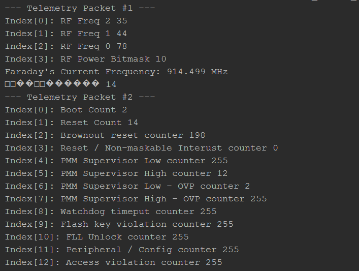

# Tutorial - Proxy Interaction Basics

In this tutorial the three Telemetry packets available from Faraday are queried, parsed, and displayed. This makes use of the telemetry parsing tool module and more detailed information can be found in the telemetry application and packet definition documentation.

##Telemetry Packet Types

* **System Operation Information**
  * Current operation details (frequency, power levels, etc...)
* **Device Debug Information**
  * Non-volatile system failure/reset counters useful for debugging
* **Main Faraday Telemetry**
  * Faraday telemetry that include all peripheral data (i.e GPS, ADC's, etc...) 

#Running The Tutorial Example Script

## Start The Proxy Interface

Following the [Configuring Proxy](../../0-Welcome_To_Faraday/Configuring_Proxy/) tutorial configure, start, and ensure a successful connection to a locally (USB) connected Faraday digital radio.

## Tutorial Output Examples

below is a screen-shot of the partial output of the tutorial script when run in a python interpreter (PyCharm). The script 

