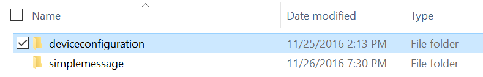
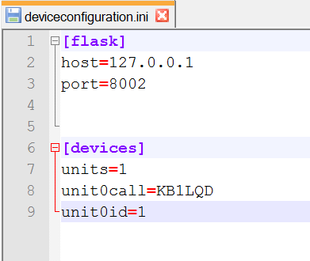
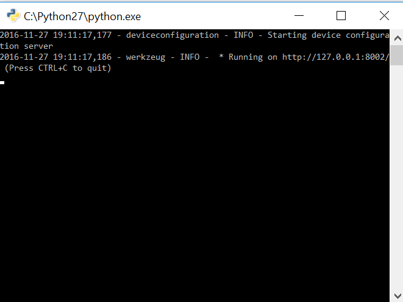
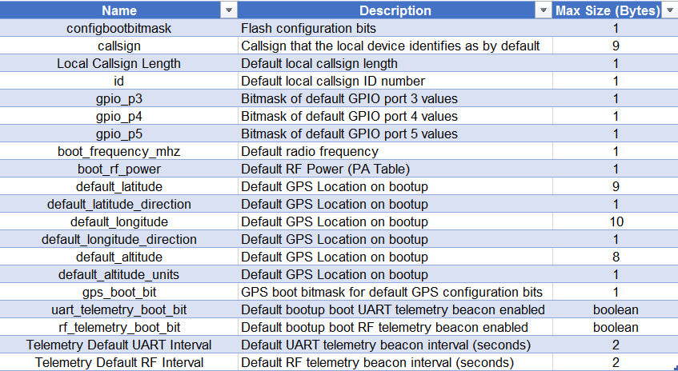

# Tutorial - Device Configuration

This tutorial will example how to use the Device Configuration program to both read and write non-volatile Faraday unit configuration using the proxy interface. This configuration data is stored in the CC430 Flash memory and is used to store the units callsign, ID, and other information/default settings.

Reconfiguring the non-volatile memory on Faraday requires using the "Device Configuration" proxy application. The configuration can both be read from the device and reprogrammed. The device application program uses the `faraday_config.ini` file to reprogram a Faraday device, sending a RESTful POST command to the program initiates the reading, parsing, and command creation from the `faraday_config.ini` file.

> NOTE: Device Configuration using the application tool in this tutorial is currently limited to programming a single device at a time.

#Running The Tutorial Example Script

## Start The Proxy Interface

Following the [Configuring Proxy](../../0-Welcome_To_Faraday/Configuring_Proxy/) tutorial configure, start, and ensure a successful connection to a locally (USB) connected Faraday digital radio.

## Start The Device Configuration Application

In the Applications folder locate and open the folder named *"deviceconfiguration".*

Open the *"deviceconfiguration.ini"* file with a text editor.

Update the INI section **[devices]** contents to match that of the proxy interface configuration file for the respective Faraday unit you wish to program with a new configuration. Save the file when completed. 

* `units` = 1
* `unit0call` = Callsign of proxy Faraday device to reconfigure
* `unit0id` = Callsign ID number (0-255) of proxy Faraday device to reconfigure

For example, to connect the Device Configuration tool to `KB1LQD-1` The file would be updated as shown below.

Run the *"deviceconfiguration.py"* python script. A successful connection will show a terminal output similar to below.

## Edit Faraday Configuration Settings

Open the `faraday_configuration.ini` file in a text editor. Edit all of the fields with the intended reprogramming values.

The table below describes each INI file option and maximum size. Also supplied is the BITMASK configuration description table.

#See Also

