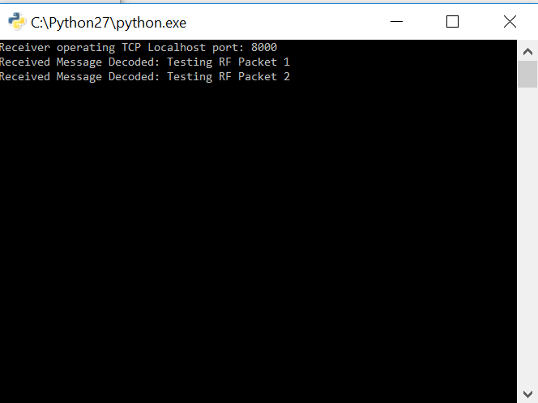

# Tutorial - Experimental RF Command

Within the command program is a command called "Experimental RF Packet Forward" and it does just that: Send a single packet (payload) from your local device to a remote device using a wireless command transmission. A transmission is sent as a normal RF command with the data being forwarded as payload, when received it will be forwarded to UART at the remote device. ***This enables simple proxy (Python) packet protocol experimentation without the need for CC430 programming!***

Although there is limited optimization and flexibility available this provides the educational basis for:

* Single data packet transmissions
* Text message programs
  * Packet fragmentation, sequencing, protocol state machines
* File transfer
  * ARQ protocols

These tutorial scripts will transmit a single packet a) from a saved variable and b) from user typed input to a receiver program between two Faraday digital radios.

#Running The Tutorial Example Script

## Start The Proxy Interface

Following the [Configuring Proxy](../../0-Welcome_To_Faraday/Configuring_Proxy/) tutorial configure, start, and ensure a successful connection to **BOTH** locally (USB) connected Faraday digital radios.

## Edit Local/Remote Device Information

###Transmit Python Script(s)

The tutorial transmit python scripts (`Tutorial_Exp_RF_Packet_TX.py` and `Tutorial_Exp_RF_Packet_TX-User-Input.py`) variables listed below hold the local and remote Faraday device callsign/ID numbers. The local device communicates through the proxy interface and regardless of actual assigned callsign/ID the variables must match that assigned by the *"proxy.ini"* file. The remote device callsign/ID variable is used to address the RF packet and must match that of the remote unit device configuration to be communicated with.

> NOTE: Ideally the proxy assigned callsign/ID matches the unit device configuration but this is not controlled or required and care should be taken.


```python
#Local device information
local_device_callsign = 'KB1LQD'
local_device_node_id = 1

#Remote device information
remote_callsign = 'KB1LQD'
remote_id = 2
```

### Receiver Python Script

Update the receiving python script `Tutorial_Exp_RF_Packet_RX.py` local Faraday device callsign and ID number connection information to interact with the intended proxy device for receive.

```python
#Local device information
local_device_callsign = 'kb1lqd'
local_device_node_id = 2
```

## Start The Receiver

Run the `Tutorial_Exp_RF_Packet_RX.py` script and when properly conneted to the proxy Faraday device a terminal propmt like below should appear:


## Execute Tutorial Script `Tutorial_Exp_RF_Packet_TX.py`

Simply running this script will transmit two predefined data messages (ASCII) one after the other to the receiver and be displayed!





## Execute Tutorial Script `Tutorial_Exp_RF_Packet_TX-User-Input.py`

The "User Input" transmitter program will open a prompt (left) when run thats asks for you to enter text to be transmitted to and displays on the receiver (right)  terminal.


Type in any message (keep in legal for Part 97!) to the transmitter prompt the is less than 42 characters (bytes) long and press enter to transmit. You should see the receiver print the message!


Congratulations, you just transmitted your first simple text message using Faraday!

#Code Overview

## Code - 

# Troubleshooting

The addition of wireless communications invites more chances for setup and reliability issues. Below are a few quick items to check if you are not able to runing the tutorial script is not commanding the remote unit correctly.

**Remote Callsign/ID**

Check that the correct callsign and ID number of the remote device is correct (as programmed) or the MAC layer protocol will not allow the remote unit to accept the command. All commands accepted by a unit over RF must match be properlly addressed.

**RF Power - Desensing**

Faraday is actually quite sensitive and having a high power signal transmit between two close units can cause the receiving device to not hear the transmission. This is called radio de-sensing. The solution is to turn the power down, typically for a foot or two I've found a setting under 20 works well.

#See Also


