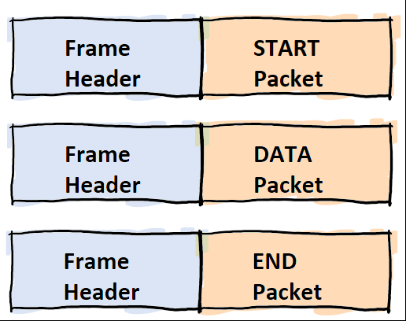
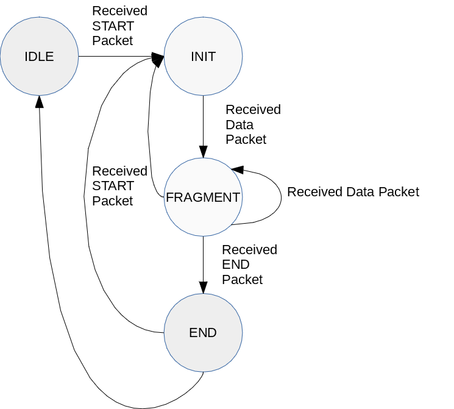
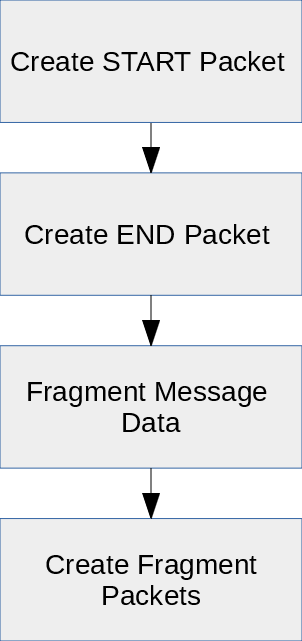
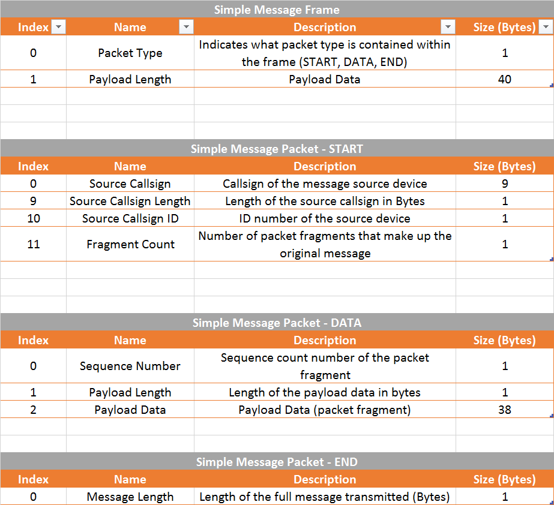

# Tutorial - Simple Text Messaging Application Using Experimental RF Command

As demo'd in the previous tutorial it is possible to send short packets between two Faraday's using only python code and use of the "Experimental RF Packet Forward" functionality. Transmitting messages longer than a single packet is not possible without introducing the concent of packet fragmentation and encapsulation.

Packet fragmentation breaks a large packet into smaller "chunks" for transmission, the receiver reassembles these chunks of data piece by piece until the original packet has been recreated. 

Packet encapsulation is the act of placing one packet (or portions of a packet) into another packet as data payload. In order to reassemble correctly several key issues need to be addressed:

* Ordering of fragmented packets needs to be maintained
* Receiver must know when to start and stop reassembling a fragmented packet

There are also several key items that will NOT be addressed:

* Error detection and correction will not be addressed for simplicity
* All commands must be addressed to the intended Faraday; Experiemental RF packet forward command cannout be "broadcasted" to all devices.
  * A more complicated dedicated messaging program will achieve this

## Program Structure

The transmit and receive messaging funcitons are provided by two class objects `MsgStateMachineTx()` and `MessageAppRx()` respectively in the `faradaymsg.py` script. These objects contain the fragmentation, sequencing, and other functions that create the simple messaging program. 

### Fragmentation Packets

Fragmentation of the packets must be accompanied by a method for the receiver to know when a new message has started, stopped, and the order of the received fragments. Three packet types have been created and are encapsulated inside a simple fixed length "Frame" (header) that indicates which packet type was received.

* **START Packet:** Indicates the beginning of a new message to receive and contains information such as source station ID and expected length/fragmentation packets to receive.

* **DATA Packet:** This packet contains one fragmented packet as a payload and is used each time as the a single fragmentation is transmitted until completed. It contains a simple header that indicates the sequence ordering for reassembly.

* **END Packet:** Indicates the message transmission has completed and contains a final message size in bytes. The message size in bytes is a very simple error detection method although not very reliable (it will detect lost packets).

### Receiver - Assembling Fragmented Data

* **IDLE:** Program waits here until a new message to receive is detected (START packet)

* **INIT:** Message buffer is cleared and fragmentation counters reset 

* **FRAGMENT:** The state operated during reception of all sequential fragmentation packets and reassembly

* **END:** Indicates the last packet has been received and to complete reassembly of message and return to idle

### Transmitter - Fragmenting Data

The transmitter class operations are very straight forward in their operational flow to create the needed frames/packets.

### Transmitter - Transmitting Fragmented Data

The transmitter program then transmits the packets in the specific order to match the receiver state machine operational flow.

#Running The Tutorial Example Script

## Start The Proxy Interface

Following the [Configuring Proxy](../../0-Welcome_To_Faraday/Configuring_Proxy/) tutorial configure, start, and ensure a successful connection to **BOTH** locally (USB) connected Faraday digital radios.

#Apendix

## Frame and Packet Definitions

(Make better!)

