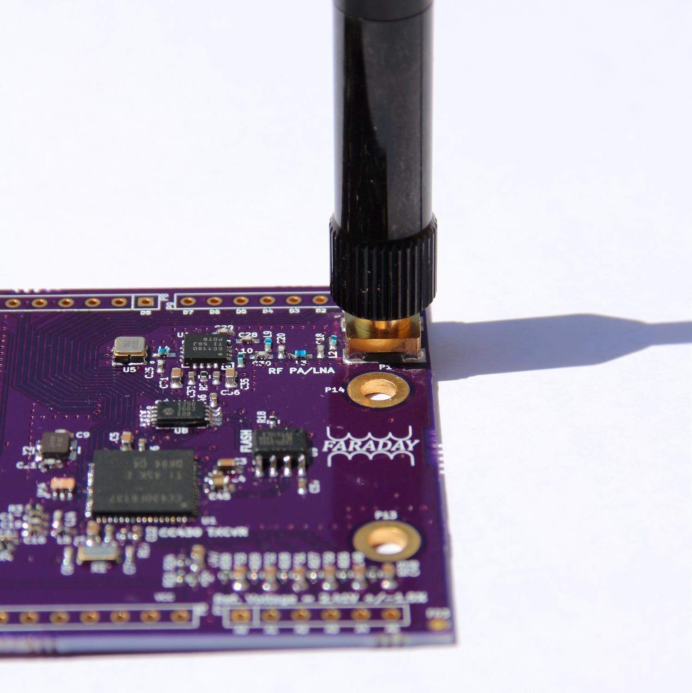
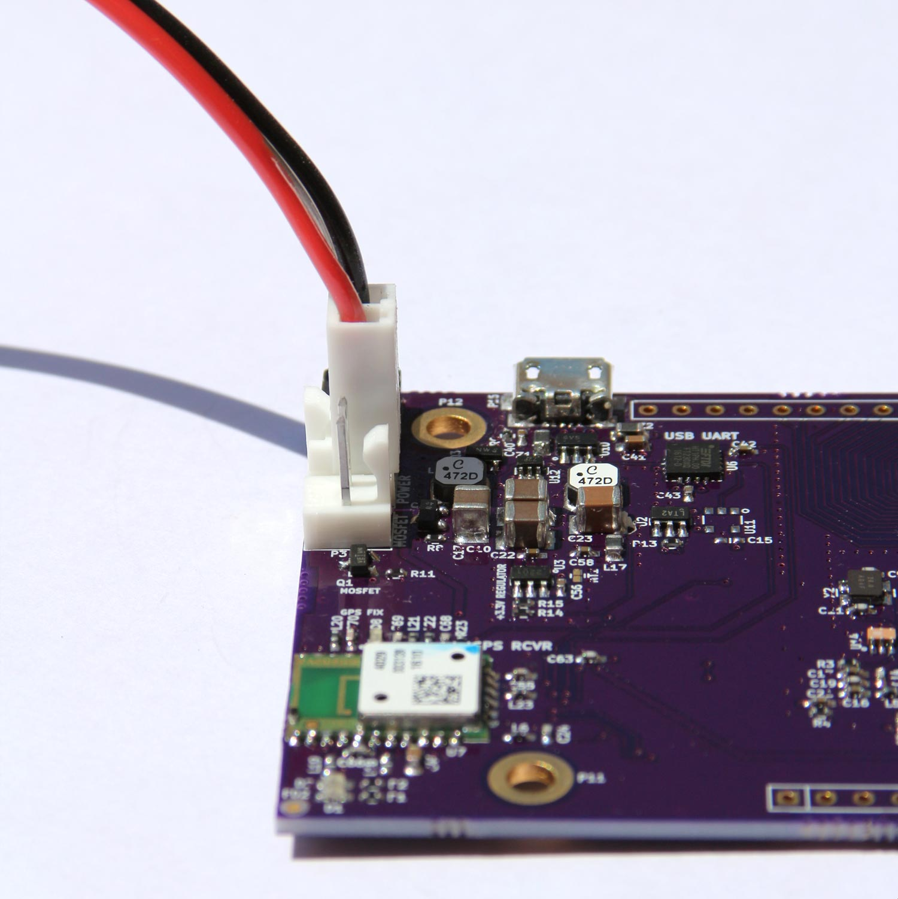

# Getting Started With Faraday

Thank you for purchasing a Faraday radio! We truly appreciate it. Staying true to open hardware we'd like to congratulate anyone who built up their own too.

**These tutorials and code are a work in progress, we encourage you to help identify and fix issues with us**. Simply create an issue ticket on GitHub or contact us at Support@FaradayRF.com if you find something wrong or think you can clarify anything.

## Getting Started Overview
 1. This page
 2. [Installing Faraday Software](installing-software.md)
 3. [Connecting Faraday](connecting-hardware.md)
 4. [Configuring Proxy](configuring-proxy.md)
 5. [Configuring Faraday](configuring-faraday.md)
 6. [Turn on The LED's](hello-world.md)

## Getting to Know Faraday
We want you to understand some basics about the radio before we move on. Faraday is sectioned off into areas of operation. Each area performs a necessary function. This design also helps seperate noisy circuits from sensitive ones which improves performance.

## Faraday Connectors

### SMA Antenna
Attaching an SMA antenna or SMA cable to Faraday is a simple task. Simply screw the antenna carefully into the SMA connector (P1) with a clockwise rotation. There should be no increase in resistance until the antenna or connector bottoms out. If so, stop and remove antenna to try again carefully.

### Micro-USB Connector
Faraday uses a standard Micro-USB connector which means any Micro-USB cable will attach. Some are better than others and a quality USB cable will have shielding that runs the length of the cable. Simply insert the connector as you would any USB connector. Please be mindful of over-stressing the connector solder pads.

<Insert Image>

### External Power Connector
The external power connector and external MOSFET connectors are adjacent to each other and are the same keying. This means you can connect power to both so **be careful**. P3 (MOSFET) and P4(External Power) are rotated 180 degrees from each other to help identify them.  We've [tested that no damage will be done](https://github.com/FaradayRF/FaradayRF-Hardware/issues/49) if you do thanks to careful design.

Connect your power connector to P4 as shown below. External Power, P4, is located closer to the top of the board.

### External MOSFET Connector
This connector operates in exactly the same fashion as the external power connector P3. However, it is an "output" where the on-board MOSFET simply completes the conduction path when commanded. One wire is VCC which can short to anything referenced to Faraday ground. **Be careful**! An external power source must be connected between VCC and Ground on P4 to actually use the MOSFET on P3. USB Power cannot be sourced externally from this connector.

# Preparing Your Computer
Now that you are aquainted with Faraday let's [get your computer setup](installing-software.md) to run Faraday software.
