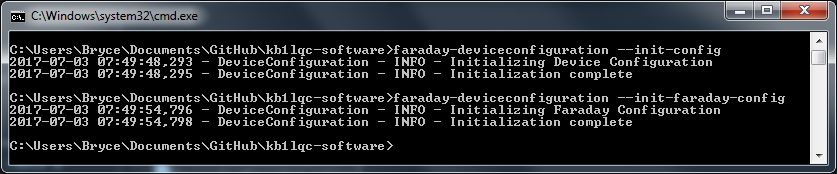
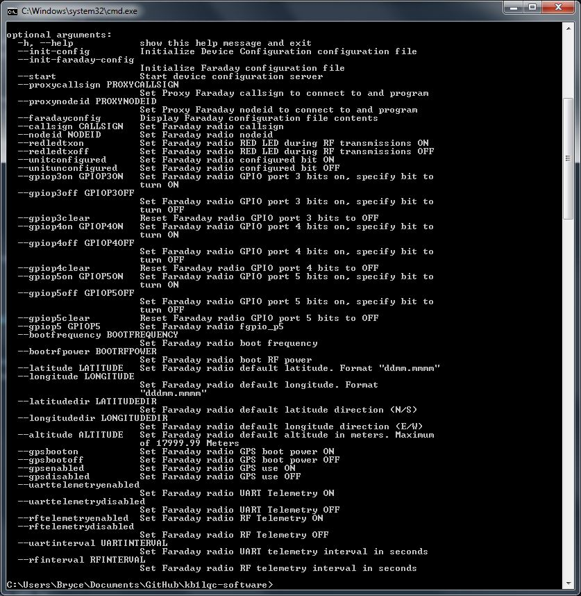
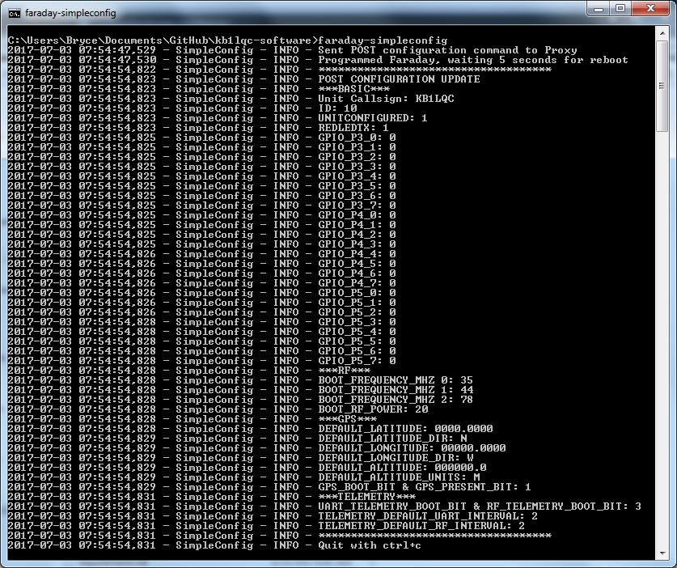

# Configuring Faraday

Now we should configure Faraday itself. The device configuration data is stored in the CC430 Flash memory and is used to store the callsign, ID, static GPS location, telemetry interval, among other settings.

The `faraday-deviceconfiguration` program communicates with the Proxy server enabling easy configuration of Faraday hardware. Let's use it to give your Faraday radio a callsign and other necessary configuration values. Additionally, we use `faraday-simpleconfig` to kick off the programming actions and display relevant information back to you.

## Initializing Device Configuration
Just as with Proxy, we need to initialize the configuration file for `faraday-deviceconfiguration`. To do this run the following command:
* `faraday-deviceconfiguration --init-config`

Additionally we need to initialize the faraday radio configuration file. This is nearly the same:
* `faraday-deviceconfiguration --init-faraday-config`



## Configuring Device Configuration
Now we need to tell the `faraday-deviceconfiguration` program where to find Proxy and what to configure the radio with. At this time the resulting command can be long so please be careful. Here are the configuration options:



The options we must change include:
* `--proxycallsign CALLSIGN`: The callsign that Proxy is using
* `--proxynodeid NODEID`: the nodeid that Proxy is using
* `--callsign CALLSIGN`: the callsign to program Faraday with
* `--nodeid NODEID`: the nodeid to program Faraday with
* `--start`: Tells `faraday-deviceconfiguration` server to start

The options you may want to change depending on hardware and needs:
* `--latitude LATITUDE`: default latitude to use when GPS is disabled
* `--longitude LONGITUDE`: default longitude to use when GPS is disabled
* `--latitudedir LATITUDEDIR`: default latitude direction (N/S) to use when GPS is disabled
* `--longitudedir LONGITUDEDIR`: default longitude direction (E/W) to use when GPS is disabled
* `--altitude ALTITUDE`: default altitude (0-17999.99 meters) to use when GPS is disabled.
* `--gpsbooton`: Enable GPS boot power
* `--gpsbootoff`: Disable GPS boot power
* `--gpsenabled`: enable GPS use
* `--gpsdisabled`: enable GPS use
* `--rftelemetryenable`: enable RF telemetry transmissions
* `--rftelemetrydisabled`: Disable RF telemetry transmissions
* `--rfinterval RFINTERVAL`: RF transmission interval in seconds

An example configuration command would be:

 ```
 faraday-deviceconfiguration --proxycallsign kb1lqc --proxynodeid 2 --callsign kb1lqc --nodeid 10 --rftelemetryenable --rfinterval 2 --start
 ```

Please remember if you already configured a setting it does not need to be set again in future executions of `faraday-deviceconfiguration`. You may check the current Faraday configuration file by running `--faradayconfig` which will print out the file contents.

## Programming Faraday
You're almost there! One more step. We've configured the `faraday-deviceconfiguration` server and told it what values to program the radio with. Now it's time to actually program Faraday. We do this by interfacing the `faraday-deviceconfiguration` API to "kick" off the programming using a script provided with faraday called `faraday-simpleconfig`.

### Reading the CC430 FLASH Configuration
We've added a useful feature to SimpleConfig which lets you query Faraday without programming it. Therefore you can see what the current FLASH configuration is. You must have `faraday-proxy` and `faraday-deviceconfiguration` running to perform this action.

* `faraday-simpleconfig --read`



### Programming CC430 FLASH configuration
Now the time has come to actually program Faraday. To do so you simply run SimpleConfig which results in Device Configuration sending a POST request to Proxy to program the radio. After waiting five seconds, SimpleConfig will also send a GET request to query the contents of the CC430 FLASH memory helping confirm the intended settings.

* `faraday-simpleconfig`

## Proxy Considerations
Once you configure your hardware it will report as the new callsign-nodeid. Proxy will operate regardless of the reported station credentials. We recommended keeping Proxy and all relevant Proxy configurations updated with the latest station credentials. This means your proxy will run just fine after programming even if callsign-nodeid are different.

# Time to Use the API
With the Proxy setup and the radio programmed, we now have the ability to communicate with Faraday using a RESTful API. Next step, [run the  Telemetry application](telemetrystart.md) and use the Faraday API to see data in your web browser!
