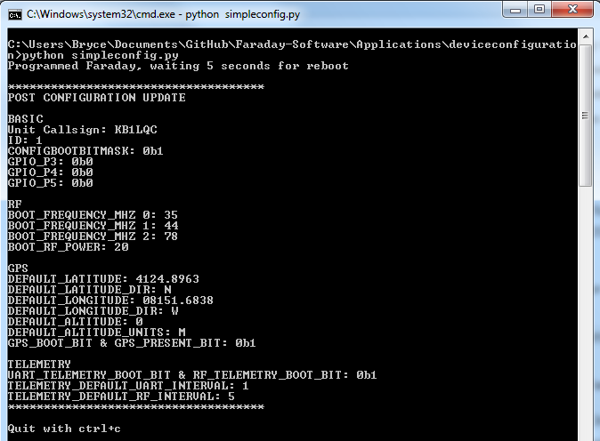

# Configuring Faraday

Now we should configure Faraday itself. The device configuration data is stored in the CC430 Flash memory and is used to store the callsign, ID, static GPS location, telemetry interval, and other settings.

In the deviceconfiguration folder located in the Applications folder lives our Device Configuration program, `deviceconfiguration.py`, which is a Flask application that is run in the background waiting to be given data to program on Faraday. It exposes a RESTful API to do so and communicates with Proxy in order to configure the radio. `simpleconfig.py` is a script which reads the `faraday_config.ini` file and sends HTTP POST and GET queries to the `deviceconfiguration.py` server.

The application files are located:

 * `~/Applications/deviceconfiguration`

> NOTE: Device Configuration using the application tool in this tutorial is currently limited to programming a single device at a time. Also, this process will be automated in the future.

## Device Configuration Setup

First we should ensure the Device Configuration program can communicate with Proxy running in the background. For this we need to edit the `[DEVICES]` section of `deviceconfiguration.ini` to contain the same configuration Proxy is configured with in `proxy.ini`

`[FLASK]`: Flask server configuration values
 * `HOST`: IP Address or hostname of flask server
 * `PORT`: Network port to serve data

`[DEVICES]`: Unit 0 Proxy configuration values section
 * `UNITS`: Quantity of Faraday radios to configure (supports one at this time)
 * `UNIT0CALL`: Callsign to associate with radio connected to Proxy
 * `UNIT0ID`: Node ID of radio connected to Proxy

## Faraday Configuration

Now you should update `faraday_config.ini` which will be used by `simpleconfig.py` to program Faraday. For now just update the `CALLSIGN` and `ID` as well as any placeholder GPS fields. Simpleconfig will error with relevant information about what is wrong in your configuration.

`[BASIC]`
 * `CONFIGBOOTBITMASK` Keep set to 1, indicates configuration has occured.
 * `CALLSIGN` Faraday radio callsign (9 characters)
 * `ID` Faraday radio node ID (0-255)
 * `GPIO_P3` Default CC430 P3 IO state, all considerd outputs at this time
 * `GPIO_P4` Default CC430 P4 IO state, all considerd outputs at this time
 * `GPIO_P5` Default CC430 P5 IO state, all considerd outputs at this time

`[RF]`
 * `BOOT_FREQUENCY_MHZ` Faraday radio frequency after a reboot, 914.5 MHz is current default. Range is 902-928MHz
 * `BOOT_RF_POWER` Faraday RF power setting, 152 is maximum however not optimal, 20 is suggested for desktop use to prevent desensing

`[GPS]`
 * `DEFAULT_LATITUDE` Latitude to default to when no GPS is present or is not used
 * `DEFAULT_LATITUDE_DIRECTION` Latitude direction to default to when no GPS is present or is not used
 * `DEFAULT_LONGITUDE` Longitude to default to when no GPS is present or is not used
 * `DEFAULT_LONGITUDE_DIRECTION` Longitude direction to default to when no GPS is present or is not used
 * `DEFAULT_ALTITUDE` Altitude to default to when no GPS is present or is not used
 * `DEFAULT_ALTITUDE_UNITS`Altitude to default to when no GPS is present or is not used
 * `GPS_BOOT_BIT` ON/OFF to allow GPS to turn on at boot
 * `GPS_PRESENT_BIT` Boolean value to inform Faraday whether there is a GPS present or not

`[TELEMETRY]`
 * `UART_TELEMETRY_BOOT_BIT` ON/OFF sending telemetry over UART after boot
 * `RF_TELEMETRY_BOOT_BIT` ON/OFF sending telemetry over RF after boot
 * `TELEMETRY_DEFAULT_UART_INTERVAL` UART telemetry interval (seconds)
 * `TELEMETRY_DEFAULT_RF_INTERVAL` RF telemetry beacon interval (seconds)

## Configuring Hardware

We are almost there! Eventually this will be automated but for now this is what we have. The following steps will start the Device Configuration application server and then send a POST command to it in order to initiate programming. Please ensure Proxy is running prior to these steps.

1. Navigate to `deviceconfiguration` folder in Explorer or terminal
2. Run `deviceconfiguration.py`
  * Windows: double-click on `deviceconfiguration.py`
  * Linux: `python deviceconfiguration.py`
3. Run `simpleconfig.py` to send configuration data to Faraday
4. Press `ctrl+c` to exit simpleconfig when complete after reviewing changes
5. Close `deviceconfiguration.py` window

Successful operation of `simpleconfig.py` will print out the Flash contents Faraday is programmed with. After successful programming the script queries Faraday over UART to send its Flash contents so we can confirm proper programming.

Note:
 * Some fields such as `BOOT_FREQUENCY_MHZ` and bitmasks return MSP430 specific values which differ from configuration values or bitmasks.

## Proxy Considerations
Once you configure your hardware it will report as the new callsign-nodeid. Proxy will operate regardless of the reported station credentials. We recommended keeping Proxy and all relevant Proxy configurations updated with the latest station credentials. This means your proxy will run just fine after programming even if callsign-nodeid are different and we suggest making the update when convenient.

# Time to Use the API
With the Proxy setup we now have the ability to communicate with Faraday using a RESTful API. Next step, [turn on the LED's](hello-world.md)!
