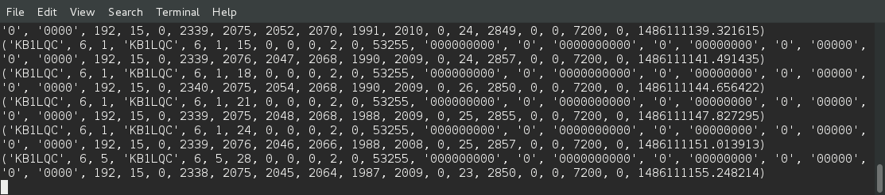

# Configuring Faraday

Now we should configure Faraday itself. The device configuration data is stored in the CC430 Flash memory and is used to store the callsign, ID, static GPS location, telemetry interval, and other settings.

Building upon our previous work, Device Configuration is an application which communicates with Proxy and provides a RESTful interface to communicate with. Configuration data can both be read and written to hardware using this program.

The application files are located:

 * `~/Applications/deviceconfiguration`

> NOTE: Device Configuration using the application tool in this tutorial is currently limited to programming a single device at a time. Also, this process will be automated in the future.

## Device Configuration Setup

`Deviceconfiguration.py` uses two .ini files, one to talk to Proxy and one to program Faraday hardware with. First we should ensure the program can communicate with Proxy running in the background. For this we need to edit the `[DEVICES]` section of `deviceconfiguration.ini` to contain the same configuration Proxy is configured with in `proxy.ini`

`[FLASK]`: Flask server configuration values
 * `HOST`: IP Address or hostname of flask server
 * `PORT`: Network port to serve data

`[DEVICES]`: Unit 0 Proxy configuration values section
 * `UNITS`: Quantity of Faraday radios to configure (supports one at this time)
 * `UNIT0CALL`: Callsign to associate with radio connected to Proxy
 * `UNIT0ID`: Node ID of radio connected to Proxy

## Faraday Configuration

Now that `deviceconfiguration.py` is configured it could be run and will sit in the background until prompted to read `faraday_config.ini`. However, let's just update this file now. For now just update the `CALLSIGN` and `ID` fields. If you do not have a GPS you may update the GPS section with relevant information as well.

`[BASIC]`
 * `CONFIGBOOTBITMASK` Keep set to 1, indicates configuration has occured.
 * `CALLSIGN` Faraday radio callsign (9 characters)
 * `ID` Faraday radio node ID (0-255)
 * `GPIO_P3` Default CC430 P3 IO state, all considerd outputs at this time
 * `GPIO_P4` Default CC430 P4 IO state, all considerd outputs at this time
 * `GPIO_P5` Default CC430 P5 IO state, all considerd outputs at this time

`[RF]`
 * `BOOT_FREQUENCY_MHZ` Faraday radio frequency after a reboot
 * `BOOT_RF_POWER` Faraday RF power (152 is max @kb1lqd ?)

`[GPS]`
 * `DEFAULT_LATITUDE` Latitude to default to when no GPS is present or is not used
 * `DEFAULT_LATITUDE_DIRECTION` Latitude direction to default to when no GPS is present or is not used
 * `DEFAULT_LONGITUDE` Longitude to default to when no GPS is present or is not used
 * `DEFAULT_LONGITUDE_DIRECTION` Longitude direction to default to when no GPS is present or is not used
 * `DEFAULT_ALTITUDE` Altitude to default to when no GPS is present or is not used
 * `DEFAULT_ALTITUDE_UNITS`Altitude to default to when no GPS is present or is not used
 * `GPS_BOOT_BIT` ON/OFF to allow GPS to turn on at boot

`[TELEMETRY]`
 * `UART_TELEMETRY_BOOT_BIT` ON/OFF sending telemetry over UART after boot
 * `RF_TELEMETRY_BOOT_BIT` ON/OFF sending telemetry over RF after boot
 * `TELEMETRY_DEFAULT_UART_INTERVAL` UART telemetry interval (seconds)
 * `TELEMETRY_DEFAULT_RF_INTERVAL` RF telemetry beacon interval (seconds)

## Configuring Hardware

We are almost there! Eventually this will be automated but for now this is what we have. The following steps will start the Device Configuration application server and then send a POST command to it in order to initiate programming. Please ensure Proxy is running prior to these steps.

1. Navigate to `deviceconfiguration` folder in Explorer or terminal
2. Run device configuration
  * Windows: double-click on `deviceconfiguration.py`
  * Linux: `python deviceconfiguration.py`
3. Run `simpleconfig.py` to send configuration data to Faraday

Successful operation of `simpleconfig.py` will quickly exit. In Windows the command window will disappear if run by double-click. Below, we see Linux configuring Faraday with simpleconfig. This example changed KB1LQC-1 into KB1LQC-5.

If you are running the telemetry program in the background you will actually be able to see the switch-over occur. Look at the image below to see the last two telemetry packets where the switch occured.

## Proxy Considerations
Once you configure your hardware it will report as the new callsign-nodeid. Proxy will operate regardless of the reported station credentials. We recommended keeping Proxy and all relevant Proxy configurations updated with the latest station credentials.

# Time to Use the API
With the Proxy setup we now have the ability to communicate with Faraday using a RESTfup API. Next step, [turn on the LED's](hello-world.md)!
