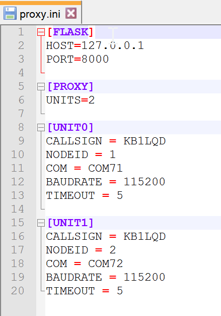

# The Proxy Interface

[Proxy](../../proxy) is the gateway to Faraday. It is a Flask server providing a RESTful interface with Faraday hardware. All actions with Faraday from a computer go through Proxy. To learn the details of Proxy read its documentation.

## Configuring Proxy
>This guide will walk you through these steps for the proxy configuration file.  The config files for other applications are modified in the same way.

### Configuration Files
Some applications require user specific information in order to operate. Most commonly, `CALLSIGN` and `NODEID` are required so the software knows which radio to communicate with. Each application that needs user information looks for it in a configuration file. In general, a given application `ex: application.py` it will gather configuration information from the *.ini* file in the same folder with the same name as the application `ex: application.ini`. Since these configuration files contain user specific information, they are listed in the .gitignore file to prevent contributors from committing their personal configs to the repository by accident. For each application, a default file is stored in the git repository  with *.sample* added to the file name before the extension `ex: application.sample.ini`. This file contains all of the required fields with either default information or `REPLACEME` noting that user information is required.
 
Before you can use an application that requires user specific information, you need to create the *.ini* file with your info.
 
 1. Navigate to the folder with the application
 2. Create a copy of `application.sample.ini` in the same folder
 3. Remove the *.sample* from the name of the new file leaving `application.ini`
 4. Open `application.ini` in a text editor and update the requested information noted by `REPLACEME`
 
### Proxy Configs Overview
Proxy.ini is a plaintext ASCII file which contains the necessary configuration values to properly connect with and identify hardware when Proxy is initialized. Multiple Radios can be connected at once by simple extension of the [UNITx] sections where x is the zero-indexed enumeration of Faraday radios connected to the computer.
 
>This guide assumes you have already [connected a Faraday radio](connecting-hardware.md) to your computer!
 
 * `[FLASK]`: Flask server configuration values
  * `HOST`: IP Address or hostname of flask server
  * `PORT`: Network port to serve data
 * `[PROXY]`: Proxy server high level configuration
  * `UNITS`: Quantity of Faraday radios connected to computer
 * `[UNIT0]`: Unit 0 Proxy configuration values section
  * `CALLSIGN`: Callsign to associate with radio on this USB port
  * `NODEID`: Node ID of radio connected on this USB port
  * `COM`: COM/serial Port associated with the radio connected
 
### Windows
 
> There is no need to change any other Proxy.ini settings unless you know what you're doing!
 
 1. Navigate to the `Proxy` folder
 2. Create a copy of `proxy.sample.ini` and rename the new file `proxy.ini`
 3. Open the `proxy.ini` file in a text editor to edit `[UNIT0]` values
 4. Change `CALLSIGN` Replace `REPLACEME` to match your callsign
 5. Change `NODEID` to an appropriate node ID value that is not already in use. Numbers between 0-255 are valid.
 6. Change `COM` to match the COM port indicated while [connecting Faraday](connecting-hardware.md). `x` represents a number.
 6. Save the file as `proxy.ini`
 
A proper configuration file will look similar to the configuration below. Notice the radio is `KB1LQD-1` on `COM71`.
 

 
###Linux (Debian-Based)
 
> There is no need to change any other Proxy.ini settings unless you know what you're doing!
 
 1. Open `proxy.sample.ini` with a text editor i.e `gedit git/faradayrf/software/Proxy/proxy.sample.ini`
 2. Update `CALLSIGN` Replace `REPLACEME` to match your callsign
 3. Update `NODEID` to an appropriate node ID value that is not already in use. Numbers between 0-255 are valid.
 4. Update `COM` to match the device dev path indicated while [connecting Faraday](connecting-hardware.md).
 5. Save the file as `proxy.ini`
 
A proper configuration file will look similar to the configuration below. Notice the radio is `KB1LQD-1` on `COM71`. For Debian `COM71` would be `/dev/ttyUSB0` in this example.
 
###Mac OS X
 
> There is no need to change any other Proxy.ini settings unless you know what you're doing!
 
 1. Open `proxy.sample.ini` with a text editor `faradayrf/software/Proxy/proxy.sample.ini`
 2. Update `CALLSIGN` Replace `REPLACEME` to match your callsign
 3. Update `NODEID` to an appropriate node ID value that is not already in use. Numbers between 0-255 are valid.
 4. Update `COM` to match the device dev path indicated while [connecting Faraday](connecting-hardware.md).
 5. Save the file as `proxy.ini`
 
A proper configuration file will look similar to the configuration below. Notice the radio is `KB1LQD-1` on COM71. For Mac OS X `COM71` would be `/dev/cu.usbserial-40` as an example.

## Connecting Proxy to Faraday

Double-click on `proxy.py` to run it from a file explorer.
Alternatively one can simply run proxy from command line:

### Windows
For example `python C:\faradayrf\software\Proxy\proxy.py`

###Linux (Debian-Based)
For example `python faradayrf/software/proxy/Proxy.py`

###Mac OS X
For example `python faradayrf/software/proxy/Proxy.py`

###Proxy Running
With Faraday connected and `proxy.py` properly configured you will see a screen similar to that shown below upon initialization.


> Once connected leave proxy running. It is a background application which provides a service to our core applications.

Congratulations, Proxy is now running successfully!

### Connection Error

An incorrect COM/serial port assignment or unconnected Faraday radio will cause the following common error to appear.


> Check your COM port settings and that you did not change `baudrate` in `proxy.ini`

## Connecting To Multiple Faraday Devices

> This feature is currently broken in `Master` and we are actively working on [Issue #86](https://github.com/FaradayRF/Faraday-Software/issues/86) to fix it!

The proxy interface can connect to more than one Faraday digital radio at a time and this is achieved by creating more instances of `[UNITx]` sections and updating the `UNITS` value in the `[PROXY]` section.

### Windows
 1. [Connect](connecting-hardware.md) ***both*** Faraday radios to your computer via USB and identify their respective COM ports. 
 2. Open and configure the `proxy.ini` by changing `UNITS` in the [PROXY] section to indicate the quantity of radios connected to the computer. Also add a `[UNITx]` section for each radio.

A proper ```proxy.ini``` configuration file will resemble the example below.



# It's Time To Configure Faraday
Now that Proxy is running, we can communicate with the radio. This means we should program it with some basic information such as your callsign and its node ID. Let's [configure Faraday](configuring-faraday.md).
