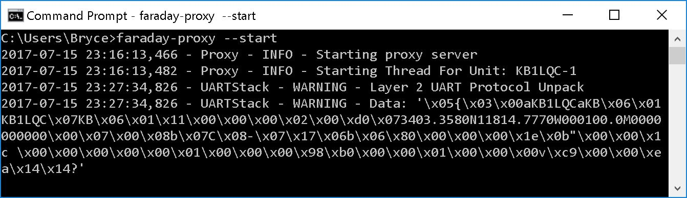

# The Proxy Interface

[Proxy](../../proxy) is the gateway to Faraday. It is a Flask server providing a RESTful interface with Faraday hardware. All actions with Faraday from a computer go through Proxy. To learn the details of Proxy read the application documentation. This guide is a quick tutorial to get you up and running.

## Running Proxy
Once installed with `pip` or in editable mode, you can start proxy by simply running `faraday-proxy` from the command line. However it must be properly configured before it will run.

## Configuring Proxy
First you must initialize the configuration file by running `faraday-proxy --init-config`. This copies our *proxy.sample.ini* configuration file into a custom *proxy.ini* file. Repeat this step whenever you'd like to start with a fresh configuration file as well.

*prox.ini* comes mostly configured so little needs to be changed. However, we do require changes to `--callsign`, `--nodeid`, and `--port` options.
* `--callsign CALLSIGN` replace CALLSIGN with the Faraday radio callsign
* `--nodeid NODEID` replace NODEID with an integer between 0-255 to ID the radio
* `--port PORT` replace PORT with the UART port faraday is connected to such as *COM10*

The entire command will look something like this:
`faraday-proxy --callsign kb1lqc --nodeid 2 --port COM23`

Proxy will automatically start when this command is run. Once configured you do not have to reconfigured unless desired and can start Proxy with `faraday-proxy`.

> * Linux users may have a port value such as `--port /dev/ttyUSB0`
> * Max OS X users may have a port value such as `--port /dev/cu.usbserial-40`

### Proxy Running
Proxy provides a server which other programs can communicate with the radio through and therefore must always be run when using the hardware. We suggest giving and entire command prompt window to Faraday as it tends to print out information when queried.

Congratulations, Proxy is now running successfully!

#### UARTStack Fail Messages
Do not be concerned if you see any message such as that shown below. This is simply a bad packet sent to Proxy over UART which failed CRC checking and was thrown out. This occasionally happens and is OK. With noisy computer grounds and poor quality USB cables one can expect to see more of these messages.

# It's Time To Configure Faraday
Now that Proxy is running, we can communicate with the radio. This means we should program it with some basic information such as your callsign and its node ID. Let's [configure Faraday](configuring-faraday.md).
