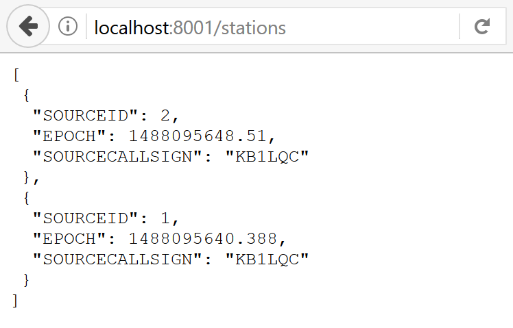
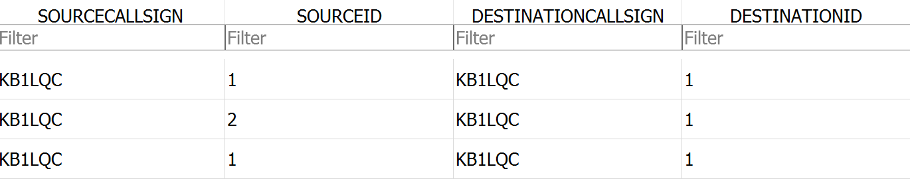
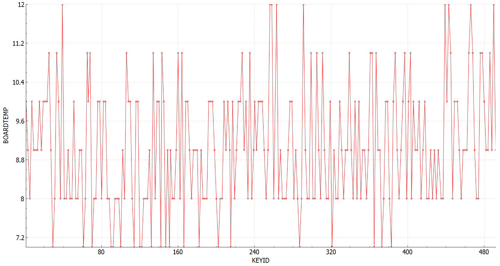
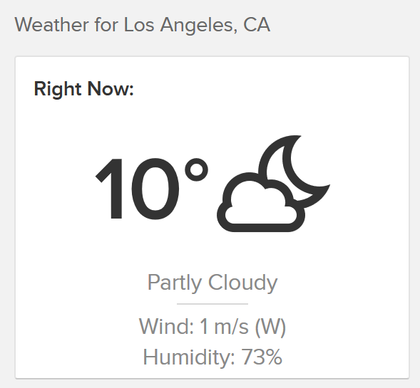
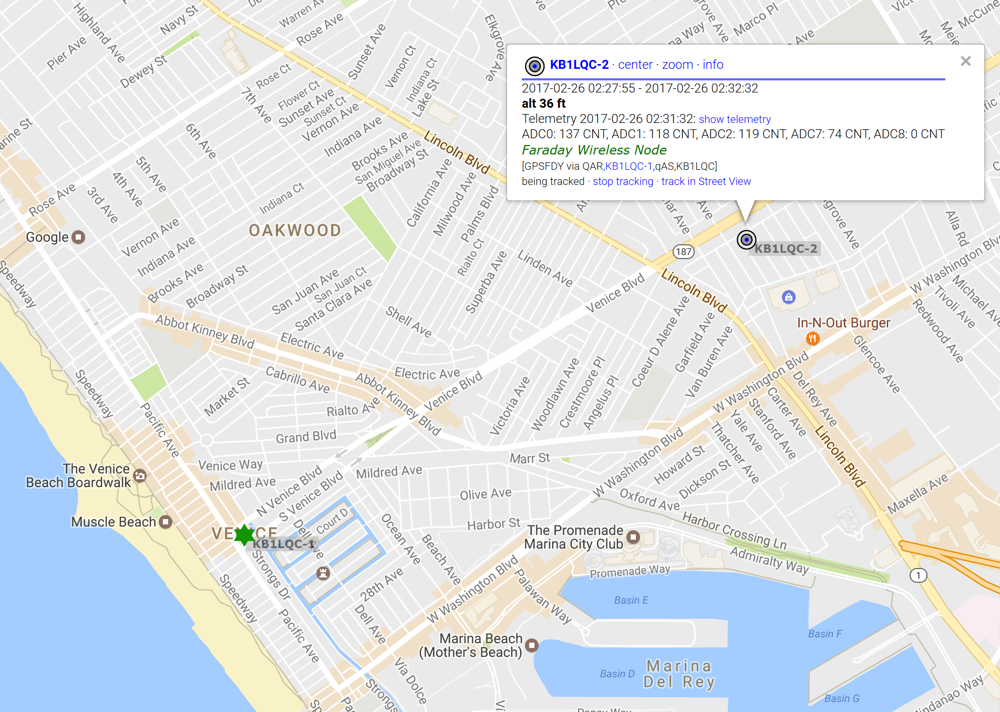
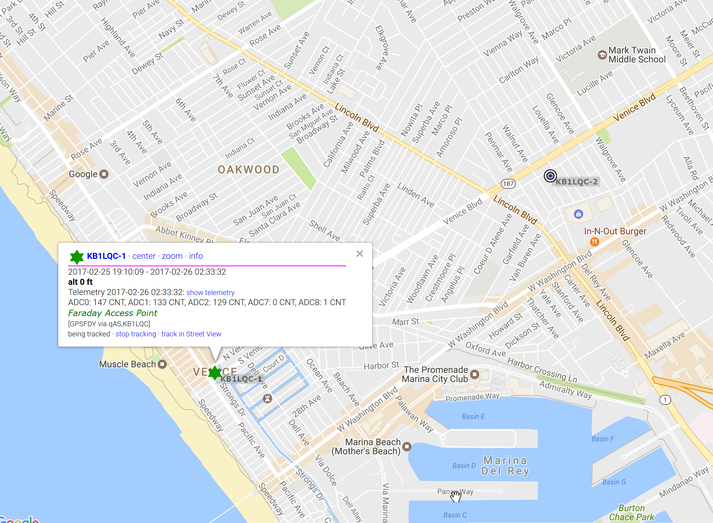

# RF Playground
Faraday has now been configured and powered up via the USB port in our [previous RF configuration guide](configuring-rf-faraday.md). This is fine but it could be too close to the Faraday being used as a base station to save data and send it around the internet. Let's setup an base station and power a remote node.

> All Faraday radio in this guide are assumed to be configured for RF transmissions with a 10 second interval

## Base Station
The base station, access point, etc is simply a Faraday attached to a computer via USB. As designed, Faraday is both a remote node and with a better antenna a powerful base station or repeater. We mean it when we say the intention is to build a new infrastructure!

You can choose any Faraday you like to be your base station but for this tutorial we will assume it is a non-GPS enabled Faraday with a Serial Number of SN 40. Let's set it up:

1. Connect Faraday SN 40 to the USB port of a computer. Ensure the antenna is installed!
2. Start [proxy](../../Proxy) and [telemetry](../../Applications/Telemetry) applications up after configuring their respective settings.
3. Check that the [Telemetry](../../Applications/Telemetry) application is receiving new data from Faraday (local) in a web browser at [http://localhost:8001](http://localhost:8001)

If you see your local node data displayed in your browser your base station is ready to go!

## Remote Node
Next up our Faraday radio which includes GPS on-board will be used for the remote node. This is a Faraday radio with a Serial Number of SN 7 in this example. Already configured for RF transmissions, it needs to be powered and moved a few feet from the base station to prevent desensing of the receiver. We find 3 feet or more works with a power setting of 20 or less. Faraday has some strong filters but in-band signals from other 33cm radios may cause problems.

### Power Sources
#### USB
Connected to a laptop or desktop computer, Faraday works just fine transmitting at full power connected to the USB port. USB battery packs will not work reliably as they require a minimum load to remain on so you may see Faraday work for a period of time and then the battery pack will go to sleep. Avoid!

#### External Power
A 9V battery connected to the [9V battery cable](https://faradayrf.com/product/9v-battery-power-cable/) included in the [Faraday Starter Pack](https://faradayrf.com/product/faraday-starter-pack/) is the easiest way to make the radio portable. This external [VCC/MOSFET External Cable](https://faradayrf.com/product/vccmosfet-unterminated-cable/) can be connected to a power source ranging from 4.5V to 17V as well. Be careful when connecting to a car battery system as [load dump](https://en.wikipedia.org/wiki/Load_dump) from the alternator could destroy Faraday. If you do this additional protection circuitry should be used though you may get away with a 5V USB adapter in a car (those protect themselves).

The connector P4 is labeled with a small "POWER" silkscreen text and is the correct connector to plug in the 9V battery cable to. Do not worry about temporarily mixing up connectors P4 and P3. While you should always power Faraday from P4 we used some snazzy engineering to prevent any damage from occurring if you mix up both connectors and battery polarity. Plug in with ease of mind!

Faraday will boot up and automatically transmit at the RF telemetry interval and power level it was configured for.

## Viewing Telemetry
First off, let's see what stations your base station is hearing. The [telemetry](../../Applications/Telemetry) application provides a handy `/stations` API that will return the callsign, nodeid, and latest EPOCH of all stations heard within the last five minutes.

### /Stations URL
* Open up a web browser and navigate to [http://localhost:8001/stations](http://localhost:8001/stations)

You should see at least two stations present, the base station (KB1LQC-1) and the RF remote node (KB1LQC-2) as shown in the example below. This is a quick way to check if everything is working! You will have to wait for whatever RF interval the radios were programmed to before data appears. Additionally, stations which have not transmitted less than 5 minutes ago simply will not show up unless you specify a new timespan for the `/stations` query. Please see the [telemetry](../../Applications/Telemetry) documentation to do this if necessary.

### DB Browser for SQLite

Looking at your [telemetry](../../Applications/Telemetry) database (telemetry.db) you should now see both the local and remote nodes in the results.

`SOURCECALLSIGN` and `SOURCEID` indicate which radio callsign-nodeid sent the data. `DESTINATIONCALLSIGN` and `DESTINATIONID` indicate which Faraday radio received the telemetry and placed it into the database.

If `SOURCECALLSIGN`-`SOURCEID` == `DESTINATIONCALLSIGN`-`DESTINATIONID` then that telemetry is local telemetry sent over UART, not RF. If they are not equal then the telemetry is from a remote node transmitted via RF.

#### Plotting Data
DB Browser for SQLite lets you plot data easily. If not already shown select `View->Plot` from the main menu bar to bring up the plotting menu. Select `KEYID` as the X axis and `BOARDTEMP` as the Y axis to display board temperature.

Below we've plotted a short capture of PCB temperature reported from Faraday over an RF link while outside. Data was sent every 10 seconds.

Checking the weather here in Los Angeles, CA (Midnight) we see a cool 10 Celsius... Faraday is pretty close!

# Upload Data to APRS-IS

Head over to the [APRS](../../Applications/APRS) application documents and start running the APRS application to upload telemetry and position reports to the [APRS-IS](http://www.aprs-is.net/) system every minute for all stations heard. You can walk around your neighborhood, track your car, or pick up other Faraday users in the area. Helping get their data to APRS-IS is the first step in seeing the power of an infrastructure with Faraday.

Porting data into APRS-IS provides a useful way to map out Faraday locations using websites such as [aprs.fi](http://www.aprs.fi). It also crosses infrastructure boundaries and leverages our existing AX.25 RF network and supporting tools along with Faraday development.

### Playing With APRS
* Walk around the neighborhood with remote node, check range and operation
* Drive around town with a remote node, check range and operation
* Leave a base station setup to share data from any Faraday radio owner passing through to APRS-IS.
* [Launch a balloon](https://faradayrf.com/simple-faraday-balloon-launch/)!

## Wireless Node
Wireless nodes use the APRS "n" symbol representing a "node" as shown below on [aprs.fi](www.aprs.fi)

## Base Station/Access Point
Base stations use the APRS "#" symbol representing a "digi" as shown below on [aprs.fi](www.aprs.fi)

# Congratulations
Your Faraday radio is now setup with a callsign and node ID it will use to identify itself even after reboot. We've also installed all necessary programs and configured them to communicate over USB serial ports and over RF using the 33cm ham band. You're ready to go!

>We suggest you head back to the [project overview](../../README.md) and explore until ready to learn to develop applications for Faraday.
