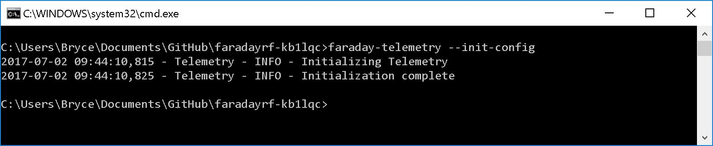
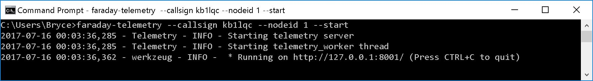
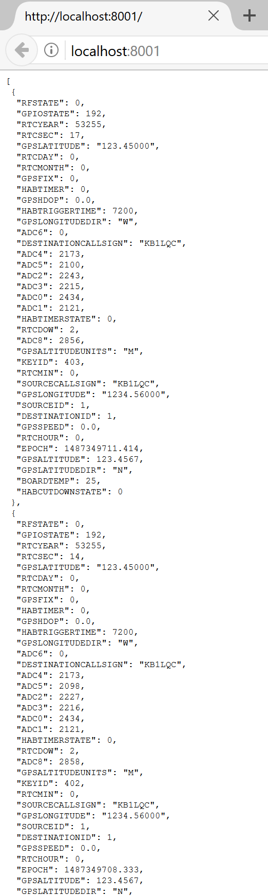

# Starting With Telemetry

Now that Faraday is configured and we know Proxy is running well we can view telemetry directly in the web browser for a quick diagnostic that everything is well. Also, if you're like us at FaradayRF we think data can be beautiful :) The [Telemetry](../../Applications/Telemetry) application is a Flask-based server which saves data to a SQLite database. It then exposes a RESTful API to query the database.

Since [Telemetry](../../Applications/Telemetry) responds with JSON data we could use a web browser to print it to the screen, Python, or any application able to query JSON responses with HTTP communications to interact.

## Initializing Telemetry
Just as we've done many times, we need to initialize the  `faraday-telemetry` configuration file. Simply run:
* `faraday-telemetry --init-config`

## Configuring & Running Telemetry

To configure the `faraday-telemetry` application simply tell it what the Proxy callsign and nodeid is as programmed when we configured `faraday-proxy`:

* `faraday-telemetry --callsign kb1lqc --nodeid 1 --start`

Running this command will start the Telemetry application which should be left running. Leaving the `--start` option out will configure telemetry without starting the server.

### Log File Locations
Please note that the telemetry log file is stored in a user specific `.faraday/lib` folder. In Windows this will be in the `%USERPROFILE%\.faraday\lib` folder and in Linux/MAX OS X this location will be `~/.faraday/lib` folder. Please see the [Telemetry](../../Applications/Telemetry) documentation for more information on manipulating these logs.

## Querying The Telemetry Application

`faraday-telemetry` uses a RESTful API to communicate over HTTP requests. However, you can easily use your web browser to interact. When you are querying the [Telemetry](../../Applications/Telemetry) application you will see data printed directly to your web browser. Reloading the webpage will perform the query again and update the information on the screen. This is a handy way to quickly debug applications as you develop them!

Example queries
* See all telemetry data (up to 1000 items): [http://localhost:8001](http://localhost:8001)
* See last five telemetry items: [http://localhost:8001?limit=5](http://localhost:8001?limit=5)
* See telemetry from specific station: [http://localhost:8001/?callsign=kb1lqc&nodeid=2](http://localhost:8001/?callsign=kb1lqc&nodeid=2)
* See stations heard in last 5 minutes: [http://localhost:8001/stations](http://localhost:8001/stations)

# Moving Forward
Now that you are obtaining telemetry from your Faraday radio it is time to command it. Turn on the LED in our [Hello World](hello-world.md) guide!
