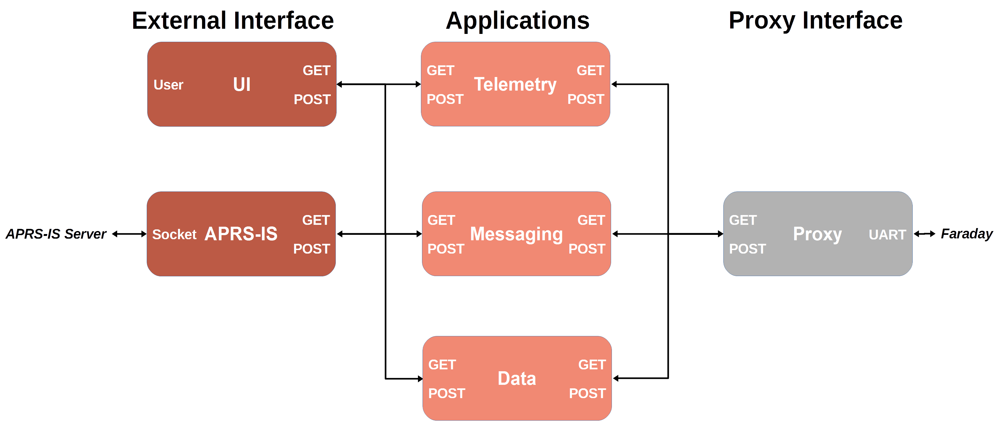

================
Proxy
================
The Proxy application is the interface between a Faraday UART USB compliant radio and the Localhost interface on a computer. It handles all serial COM port communications presenting data to the user through a RESTful interface. Nearly all applications will use the Proxy to communicate over the radio hardware. Unless you are absolutely sure you need to bypass Proxy it is highly encouraged to use it.

Basic Operation
-----------------
Proxy works on the premise of spinning up a thread which has the sole purpose of querying every "port" (0-255) of the Faraday radio to see if new data is available. This is called the "UART Worker". Upon data being available the thread will receive the data and place it into a buffer queue. This queue is 100 packets long and is a FIFO resulting in old data being popped off if no user is requesting data. The same occurs in reverse. 

A flask server runs in the main process which provides a RESTful interface for the Proxy. When the RESTful interface is queried with a GET request the thread-safe queue will pop off packets from the left for the requested Faraday "port". This data is served to the user in a JSON dictionary. If the RESTful interface received a POST request to send data to Faraday then the flask server will place the packet onto the queue from the right. Every 10ms the UART Worker checks to see if there is any data for any port in the transmit queue. If present, this data is immediately sent to Faraday via USB UART.

API Documentation
-----------------
<API documentation here>